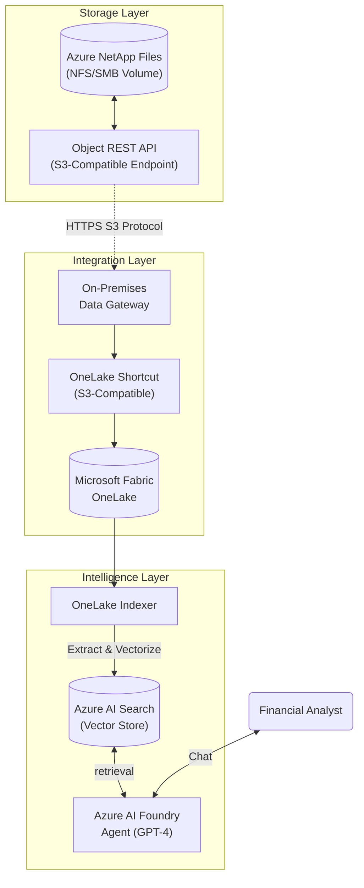

# Azure NetApp Files to Azure AI Foundry: End-to-End RAG Workshop

## 1. Overview & Architecture

This workshop guides you through building a **Enterprise RAG (Retrieval-Augmented Generation)** pipeline. You will expose financial data residing in an on-premises style **Azure NetApp Files (ANF)** volume to **Azure AI Foundry** agents, without moving or duplicating the original data.

### The "Zero-Copy" Data Flow
We utilize the **ANF Object REST API** to project files as S3 objects, which **Microsoft Fabric OneLake** consumes via shortcuts. **Azure AI Search** indexes this virtualized data, enabling an AI Agent to answer complex financial questions.



---

## 2. Prerequisites & Requirements

| Component | Requirement | Role Needed |
| :--- | :--- | :--- |
| **Azure Subscription** | Active subscription | Owner / Contributor |
| **Azure NetApp Files** | NetApp Account, Capacity Pool, Delegated Subnet | Contributor |
| **Microsoft Fabric** | Workspace with Trial Capacity | Admin / Member |
| **Azure AI Search** | Basic Tier (or higher) with Semantic Ranker enabled | Contributor |
| **Azure AI Foundry** | Hub & Project created | Contributor |
| **Lab Data** | The provided `test_data` folder (Invoices & CSVs) | N/A |

---

## 3. Step-by-Step Implementation

### Module 1: Configure Azure NetApp Files (Storage)

**Goal**: Enable S3-compatible access to your NFS volume.

> [!IMPORTANT]
> **Preview Feature**: The Object REST API is in preview. You must have applied for the waitlist and received confirmation.

1.  **Create Volume**:
    *   Go to **Azure Portal** > **Azure NetApp Files** > **Volumes** > **+ Add Volume**.
    *   **Name**: `anf-finance-vol`
    *   **Quota**: 100 GiB
    *   **Network**: Select your delegated subnet.
    *   **Protocol**: NFSv3 (Standard for Linux/Analytics) or SMB.
    *   **Review + Create**.
2.  **Enable Object Access**:
    *   **Prerequisite**: You must have a **PEM-encoded self-signed certificate** ready (for the preview security model).
    *   Navigate to your Volume.
    *   Select the **Buckets** blade (sometimes under "Storage" or "Object Access" depending on rollout).
    *   *Note*: If you see "Object Access" feature toggle, Enable it first.
3.  **Create Bucket**:
    *   Click **+ Add Bucket**.
    *   **Name**: Enter a bucket name (e.g., `finance-bucket`).
    *   **Path**: Root `/` (to expose the whole volume) or specific path.
    *   **Certificate**: Upload your PEM certificate here (First time setup).
    *   **Create**.
4.  **Generate Credentials**:
    *   Inside the new Bucket blade, click **Generate Keys** (or "View Credentials").
    *   **CRITICAL**: Copy the `Access Key`, `Secret Key`, and `Endpoint URL` (e.g., `https://10.1.1.4` or `https://<account>.blob...`). You will NOT see the Secret Key again.
5.  **Upload Data**:
    *   Access the volume via standard NFS mount or SMB share.
    *   Copy the `test_data/invoices` folder and `test_data/financial_statements` folder to the volume.
    *   *Verification*: These files should now be immediately visible via the Object (S3) endpoint.

### Module 2: Connect OneLake (Integration)

**Goal**: Virtualize the ANF data into Fabric OneLake without copying it.

1.  **Deploy Data Gateway**:
    *   Provision a **Windows Server 2022 VM** in the **same VNet** (or peering) as your ANF volume.
    *   Download the [On-premises data gateway (Standard mode)](https://aka.ms/gateway-installer).
    *   Install and sign in with your Azure AD (Entra ID) account.
    *   **Result**: The gateway status is "Online" in the Power Platform admin center.
2.  **Create Fabric Connection**:
    *   Go to **Microsoft Fabric** (app.fabric.microsoft.com).
    *   Click **Settings** (Gear icon) > **Manage connections and gateways**.
    *   Click **+ New**.
        *   **Type**: `Amazon S3 Compatible` (**Note**: Do NOT select "Amazon S3").
        *   **Gateway**: Select the generic gateway cluster created in Step 1.
        *   **Server**: Your ANF Endpoint URL (e.g., `https://10.0.1.5`).
            *   *Tip*: Ensure "Force path style access" is supported/checked if available, or just use the IP base.
        *   **Authentication**: `Key`.
        *   **Access Key**: Your ANF Access Key.
        *   **Secret Key**: Your ANF Secret Key.
    *   **Create**.
3.  **Create Shortcut**:
    *   Open your **Fabric Workspace** > **Lakehouse** (e.g., `FinanceLake`).
    *   In **Explorer**, right-click **Files** > **New shortcut**.
    *   Select source: **Amazon S3 Compatible**.
    *   Select the Connection created above.
    *   **Bucket**: Enter the volume name (e.g., `anf-finance-vol`) or the bucket name created in Module 1.
    *   **Name**: `anf_finance_data`.
    *   **Action**: Click the shortcut. You should see `invoices/` and `financial_statements/` immediately.

### Module 3: Azure AI Search (Indexing)

**Goal**: Make the data searchable and "understandable" to AI.

1.  **Import Data Wizard**:
    *   Go to **Azure AI Search** in Azure Portal.
    *   Click **Import and vectorizing data**.
    *   **Source**: Select **OneLake** (Do NOT select ADLS Gen2).
    *   **Connection**:
        *   Select "Microsoft Fabric".
        *   Choose your **Workspace** and **Lakehouse**.
        *   Browse to `Files` > `anf_finance_data`.
2.  **Configure Vectorization**:
    *   **Kind**: `Azure OpenAI`.
    *   **Model**: `text-embedding-3-small` (or `ada-002`).
    *   **Authentication**: Choose your Azure OpenAI service.
3.  **Review Index Fields**:
    *   Ensure `content` is **Searchable**.
    *   Ensure `vector` is **Vector** field.
    *   **CRITICAL**: Ensure `metadata_storage_path` is **Retrievable**. The Agent relies on this to generate citations (links to the source files).
4.  **Run Indexer**:
    *   Click **Create**.
    *   Monitor execution.
    *   **Troubleshooting**: If it fails with "Document extraction failed", ensure the OneLake path is correct and the shortcut is resolving.

### Module 4: Azure AI Foundry Agent (Consumption)

**Goal**: Create the "Brain" that uses this data.

1.  **Setup Agent**:
    *   Go to **Azure AI Foundry** > **Agents** (or "Chat" in older UI).
    *   **Create Agent**: Name it `FinanceBot`.
    *   **Model Deployment**: Select `gpt-4o` or `gpt-4-turbo`.
2.  **Add Knowledge**:
    *   Click **Add knowledge** (or Data Source).
    *   Select **Azure AI Search**.
    *   Choose the index created in Module 3.
3.  **System Prompt**:
    *   Copy/Paste the following specialized prompt:
    ```text
    You are an expert Financial Auditor Agent.
    
    Roles & Responsibilities:
    1. Analyze financial documents (invoices and transaction logs) from the attached search index.
    2. When asked for totals, you MUST retrieve all relevant line items and perform the calculation accurately.
    3. You must CITE your sources. Use the filename (e.g., 'Invoice_INV-1234.html') as the citation.
    4. If a vendor exists in both invoices and CSV logs, aggregate the data from both sources.
    
    Data Types:
    - HTML files are Vendor Invoices.
    - CSV files are Transaction Logs from our ERP system.
    ```
4.  **Save**.

---

## 4. Practical Testing Guide

Use these scenarios to validate the agent's capabilities.

### Scenario A: Unstructured Data Retrieval
*   **Prompt**: *"Find the invoice for 'OfficeMax'. What was the billed amount and the invoice date?"*
*   **What happens**: The agent searches the vector store for "OfficeMax", retrieves the HTML content of the relevant invoice, extracts the `Total Due` and `Date` fields, and responds.
*   **Success Criteria**: Correct Amount and Date, with a citation to `Invoice_INV-xxxx.html`.

### Scenario B: Structured Data Analysis
*   **Prompt**: *"Show me all transactions for 'Azure Cloud Services' in Q1 2025. What is the sum of these transactions?"*
*   **What happens**: The agent queries the index for "Azure Cloud Services" and "Q1 2025". It retrieves chunks from `Q1_2025_Expenses.csv`, reads the row values, and sums the `Amount` column.
*   **Success Criteria**: A list of transactions and a correct total (check CSV to verify).

### Scenario C: Cross-Source Synthesis (The "Zero-Copy" Value)
*   **Prompt**: *"I need a vendor spend report. Calculate the total spend for 'WeWork' including both invoiced amounts and ERP transactions."*
*   **What happens**: This demonstrates the power of the architecture. The agent must find WeWork invoices (unstructured HTML) and WeWork CSV rows (structured), extract numbers from both, and sum them.
*   **Success Criteria**: "The total spend for WeWork is $X. This includes $Y from Invoice-123 and $Z from the Q2 Expense log."

### Scenario D: Compliance & Auditing
*   **Prompt**: *"Review all invoices. Are there any bills from 'Staffing Agency' that exceed $3,000?"*
*   **Success Criteria**: The agent filters invoices (using AI reasoning on the retrieved content) and identifies any high-value bills.

---

## 5. Troubleshooting Common Issues

*   **Gateway Connectivity**: If Fabric cannot connect, check the Windows Firewall on the Gateway VM. Ensure port 443 outbound is open to the ANF Endpoint IP.
*   **Shortcut "Access Denied"**: This often happens if the "Bucket" name is incorrect. Use the exact Volume name or the mapped name from ANF settings.
*   **Citations Missing**: Go back to Azure AI Search > Indexes > Fields. Ensure `metadata_storage_path` is marked as **Retrievable**. Rerun the indexer if you change this.
