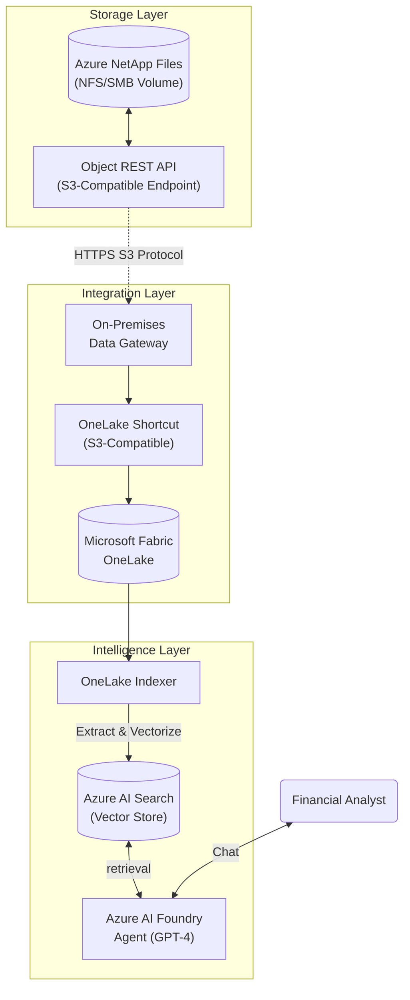

# Azure NetApp Files to Azure AI Foundry: Zero-Copy RAG Workshop

## Overview & Architecture
This lab demonstrates how **Azure AI Foundry** can ground AI agents on **enterprise file data stored in Azure NetApp Files** using **Microsoft Fabric OneLake shortcuts**, enabling a zero‑copy AI data path without ETL, data duplication, or re‑platforming.
The solution architecture uses:

*   **Azure NetApp Files** as the authoritative system of record for unstructured file data
*   **Object REST API** (S3‑compatible access) to expose file data for analytics and AI consumption
*   **Microsoft Fabric OneLake shortcuts** to virtualize Azure NetApp Files data
*   **Azure AI Search** to index virtualized data
*   **Azure AI Foundry** to build and run agents grounded on that data

This lab is intended for education, enablement, and design validation. It illustrates a supported architectural pattern, but it is not a production‑hardened reference architecture.

### What this lab demonstrates

*   How enterprise file data can remain in place on Azure NetApp Files while being consumed by analytics and AI services
*   How OneLake shortcuts enable virtualized access to file data without copying it
*   How Azure AI Foundry agents can be grounded on enterprise data through Azure AI Search
*   How Azure NetApp Files participates as a first‑class data foundation for AI workloads on Azure

### The "Zero-Copy" Data Flow
1.  **Storage**: Financial docs in ANF (NFS/SMB) are exposed via **Object REST API** (S3-compatible).
2.  **Integration**: **Microsoft Fabric OneLake** shortcuts virtualize this data.
3.  **Indexing**: **Azure AI Search** indexes the virtualized data directly from OneLake.
4.  **Consumption**: **Azure AI Foundry** agents use the index to answer questions.



---

## Prerequisites & Environment Setup

This lab is designed to be approachable for customers and partners with general familiarity with Azure. The lab emphasizes solution flow and architectural intent, while calling out external documentation where deeper service‑level setup or advanced configuration may be required.

**Goal**: Prepare your Azure subscription and user account with all necessary providers and permissions.

## 1. Validate Azure Subscription Requirements
**Goal**: Ensure your Azure subscription is ready to run the lab without permission or provider issues.
1.  **Login**:
    *   Open a browser and go to **https://portal.azure.com**
    *   Sign in with your Azure work account.
2.  **Verify Subscription Role**:
    *   In the Azure portal, search for **Subscriptions**.
    *   Select the subscription you will use for the lab.
    *   Select **Access control (IAM)**.
    *   Confirm your user has **Owner** or **Contributor + User Access Administrator**.
3.  **Register Resource Providers**:
    *   From your subscription page, select Resource providers.
    *   Ensure the following providers are Registered:
        *   Microsoft.NetApp
        *   Microsoft.Search
        *   Microsoft.CognitiveServices
        *   Microsoft.MachineLearningServices (required for Azure AI Foundry)
        *   Microsoft.Fabric (required for OneLake / Fabric)
    *   If any show **Not registered**, select the resource provider and click **Register**.

## 2. Configure Azure NetApp Files
**Goal**: Create an Azure NetApp Files volume and enable S3‑compatible (Object REST API) access.
*   **Waitlist Approval**: The "Object REST API" features for Azure NetApp Files are in Public Preview. Ensure your subscription is whitelisted.
*   **Client Tool**: Instally a tool like **Cyberduck** or **S3 Browser** on your local machine to verify S3 connectivity.

### 2.1 Create NetApp Account and Capacity Pool

1. In the Azure portal, search for **Azure NetApp Files**.
2. Click **+ Create**.
    *   **Name**: Workshop-NetApp-Account
    *   **Region**: Choose a supported region (e.g., East US)
3. After creation, open the NetApp account.
4. Select **Capacity pools** → **+ Add pool**.
    *   **Name**: Workshop-Pool
    *   **Service level**: Standard
    *   **Size**: 1 TiB (minimum)
5. Click **Create**.

### 2.2 Create a Volume

1. In the NetApp account, select Volumes → + Add volume.
2. Configure the volume:
    *   **Name**: anf-finance-vol
    *   **Quota**: 100 GiB
    *   **Virtual network**: Select a VNet
    *   **Subnet**: Select a delegated subnet (Microsoft.NetApp/volumes)
    *   **Protocol**: NFS (NFSv3 recommended for this lab)
3. Click **Review + Create** → **Create**.

### 2.3 Enable Object (S3‑Compatible) Access

Note: Object REST API for Azure NetApp Files is in Public Preview. Ensure your subscription is approved.

1. Generate a Certificate (should this be uisng the portal?)
    *   Open a terminal or command prompt.
    *   Run: `openssl req -x509 -newkey rsa:4096 -keyout private.key -out cert.pem -days 365 -nodes`
    *   Save cert.pem.
2. Enable Object Access
    *   In the Azure portal, open your volume.
    *   Navigate to Object access / Buckets (blade name may vary).
    *   If prompted, click Enable Object Access.
3. Create a Bucket
    *   Click **+ Add bucket**.
    *   **Name**: finance-data
    *   **Path**: /
    *   Upload the cert.pem file.
    *   Click **Create**.
4. Capture Credentials
    *   Select View credentials (or Generate keys).
    *   Copy and save to a secure location:
        *   Endpoint URL
        *   Access key
        *   Secret key

### 2.4 Download Lab Data
*   Download the `test_data` folder from this repository to your local machine.

### 2.5 Upload Lab Data

1. Install a client such as Cyberduck or S3 Browser.
2. Create a new S3 connection:
    *   Endpoint: ANF Object endpoint
    *   Access key / Secret key: From previous step
    *   Enable Path‑style addressing if prompted.
3. Upload the following folders to the bucket root:
    *   invoices/
    *   financial_statements/

# HERE
---

## 3. Module 1: Configure Azure NetApp Files (Storage)

**Goal**: Create an NFS volume and enable S3-compatible access.

### 3.1 Create NetApp Account & Pool
1.  Search for **Azure NetApp Files**.
2.  Click **+ Create** > Name: `Workshop-NetApp-Account` > Region: (e.g., *East US*).
3.  Go to the new Account > **Capacity pools** > **+ Add pool**.
    *   Name: `Workshop-Pool`
    *   Service level: **Standard** (sufficient for lab).
    *   Size: **1 TiB** (Minimum).
    *   **Create**.

### 3.2 Create Volume
1.  In the NetApp Account > **Volumes** > **+ Add volume**.
2.  **Basics**:
    *   Name: `anf-finance-vol`
    *   Quota: **100 GiB**.
    *   Network: Select a VNet and a **delegated subnet** (Microsoft.NetApp/volumes).
3.  **Protocol**: Select **NFS** (or SMB if preferred, NFSv3 is simplest for this lab).
4.  **Review + Create**.

### 3.3 Enable Object Access (The "S3" Step)
1.  **Generate Certificate** (Required for Preview security):
    *   Open a terminal/command prompt.
    *   Run: `openssl req -x509 -newkey rsa:4096 -keyout private.key -out cert.pem -days 365 -nodes`
    *   Keep `cert.pem` ready.
2.  **Configure Object Access**:
    *   Go to your Volume > **Buckets** (blade may vary, check **Export Policy** or **Object Access**).
    *   If prompted to "Enable Object Access", click **Enable**.
3.  **Create Bucket**:
    *   Click **+ Add Bucket**.
    *   Name: `finance-data`.
    *   Path: `/` (Root).
    *   **Upload Certificate**: Upload the `cert.pem` file you generated.
    *   **Create**.
4.  **Get Credentials**:
    *   Click **View Credentials** (or "Generate Keys").
    *   **COPY THESE NOW**:
        *   `Endpoint URL` (e.g., `https://10.0.0.4`)
        *   `Access Key`
        *   `Secret Key`

### 3.4 Upload Data
1.  Use Cyberduck/S3 Browser (or mount the volume via NFS).
2.  Connect using the S3 Credentials and Endpoint.
    *   *Note*: Use "Path Style" addressing if asked.
3.  Upload the `invoices` folder and `financial_statements` folder to the bucket root.

---

## 4. Module 2: Connect OneLake (Integration)

**Goal**: Virtualize the ANF data into Fabric.

### 4.1 Setup Data Gateway (Required for VNet Access)
1.  **Create a VM**: Deploy a small Windows VM (Standard_D2s_v3) in the **Same VNet** as your ANF Volume.
2.  **Install Gateway**:
    *   RDP into the VM.
    *   Download [On-premises data gateway (Standard mode)](https://aka.ms/gateway-installer).
    *   Install > Login with your Azure Work Account > Register New Gateway (Name: `ANF-Gateway`).
3.  **Check Status**: Ensure it says "Online" in Power Platform Admin Center.

### 4.2 Create Fabric Workspace
1.  Go to [app.fabric.microsoft.com](https://app.fabric.microsoft.com).
2.  **Workspaces** > **+ New workspace**.
    *   Name: `Financial_RAG_Workshop`.
    *   **Advanced**: License mode > **Trial** (or Fabric Capacity).
    *   **Apply**.

### 4.3 Create Connection & Shortcut
1.  **Manage Connections**:
    *   Gear Icon (Settings) > **Manage connections and gateways**.
    *   **+ New** > **Amazon S3 Compatible**.
    *   **Gateway**: Select `ANF-Gateway`.
    *   **Server**: Your ANF Endpoint URL (IP address usually).
    *   **Auth**: Key > Paste Access/Secret Keys.
    *   **Create**.
2.  **Create Lakehouse**:
    *   Go to your Workspace > **+ New item** > **Lakehouse** > Name: `FinDataLake`.
3.  **Create Shortcut**:
    *   In Lakehouse Explorer > Right-click **Files** > **New shortcut**.
    *   Source: **Amazon S3 Compatible**.
    *   Connection: Select the one created in step 4.3.1.
    *   Bucket: `finance-data` (or volume name).
    *   Name: `anf_shortcut`.
    *   **Verify**: Click the shortcut—you should see your folders.

---

## 5. Module 3: Azure AI Search (Indexing)

**Goal**: Index the data from OneLake.

### 5.1 Create AI Search Service
1.  Azure Portal > **Create a resource** > **Azure AI Search**.
2.  Tier: **Basic** (Required for Semantic Search) or Standard.
3.  **Enable Semantic Ranker**: Go to the specific setting (usually enabled by default in new Basic+ deployments, but check "Semantic Ranker" blade).
4.  **Enable Managed Identity**:
    *   Settings > **Identity** > **System assigned** > **On** > **Save**.

### 5.2 Assign Permissions (Crucial Step)
The Search Service needs permission to read OneLake.
1.  Go to your Fabric Workspace (`Financial_RAG_Workshop`).
2.  **Manage Access** (or "Workspace access").
3.  Add the **Azure AI Search Managed Identity** (search by service name) as a **Member** or **Contributor**.

### 5.3 Import Data
1.  In Azure AI Search > **Import and vectorizing data**.
2.  **Source**: **OneLake**.
3.  **Connection**:
    *   Select "Microsoft Fabric".
    *   Choose Workspace (`Financial_RAG_Workshop`) > Lakehouse (`FinDataLake`).
    *   Path: `Files/anf_shortcut`.
4.  **Vectorization**:
    *   Kind: **Azure OpenAI**.
    *   *Dependency*: Use the Azure OpenAI resource created in Module 4 (or create one now).
    *   Select the Embedding model.
5.  **Index Settings**:
    *   **Content**: Searchable.
    *   **Metadata_storage_path**: **Retrievable** (Must be checked!).
6.  **Create Indexer**: Run it.

---

## 6. Module 4: Azure AI Foundry (Consumption)

**Goal**: Provision the AI Platform and Create an Agent.

### 6.1 Create Azure AI Services Resource (The "Root" Resource)
*Before creating a Hub, you should create the underlying AI Service to ensure you have full control over the region and pricing tier.*

1.  **Azure Portal** > **Create a resource** > **Azure AI services** (Multi-service account).
2.  **Create**:
    *   Name: `Workshop-AI-Services`.
    *   Region: **East US 2** (or `Sweden Central`, `West US 3` - regions with GPT-4o).
    *   Pricing Tier: **Standard S0**.
3.  **Deploy Model**:
    *   Go to **Model deployments** (in the resource blade).
    *   Click **Manage Deployments** (opens Azure OpenAI Studio).
    *   **Deploy**: `gpt-4o` (or `gpt-4`). Name it `gpt-4o`.
    *   **Deploy**: `text-embedding-3-small`. Name it `text-embedding`.

### 6.2 Assign Your Identity Permissions
*You cannot use the AI Foundry portal effectively without permissions on the resource.*

1.  Go to the `Workshop-AI-Services` resource > **Access control (IAM)**.
2.  **Add role assignment**.
3.  Role: **Cognitive Services OpenAI User** (allows you to run inference/chat).
4.  Members: Select **Your User Account**.
5.  **Review + assign**.

### 6.3 Create AI Hub & Project
1.  Go to [ai.azure.com](https://ai.azure.com).
2.  **+ Create Project**.
3.  **Project Details**:
    *   Name: `Finance-RAG-Project`.
    *   **Hub**: Click "Create new hub".
    *   Hub Name: `Finance-Hub`.
    *   **Resource Group**: Use your existing one.
4.  **Connect Resources**:
    *   **Azure OpenAI**: Select `Workshop-AI-Services`.
    *   **Azure AI Search**: Select the service created in Module 3.
5.  **Create**.

### 6.4 Configure Data Source (The RAG Link)
1.  In your Project > Left Menu > **Data** (or "Indexes").
2.  **+ New connection** > **Azure AI Search**.
3.  System will detect your connected service. Select the **Index** created in Module 3.

### 6.5 Create & Test Agent
1.  Left Menu > **Agents**.
2.  **Deploy Model**: Select the `gpt-4o` deployment you created in step 6.1.
3.  **Add Knowledge**: Select the Search Index connection.
4.  **System Instruction**:
    ```text
    You are a Financial Auditor. 
    Use the attached financial data to answer questions. 
    Always cite the document name. 
    If data is in a CSV, calculate totals by summing rows.
    ```
5.  **Test**:
    *   *"What is the total spend for vendor 'OfficeMax'?"*
    *   *"Show me all transactions from Q1 2025."*

---

## 7. Troubleshooting

*   **Gateway Error**: Ensure the gateway VM has outbound 443 access to the ANF IP.
*   **OneLake Shortcut Empty**: Verify the bucket name in the shortcut settings matches the ANF bucket exactly.
*   **Indexer Error (403)**: Re-check Module 5.2. The Search Service Managed Identity MUST have permission on the Fabric Workspace/Item.
*   **Agent "I don't know"**: Check "Strictness" (set to 3) and ensure the Indexer ran successfully (is document count > 0?).
*   **Permissions Error in Foundry**: Ensure you assigned yourself **Cognitive Services OpenAI User** in Module 6.2.
