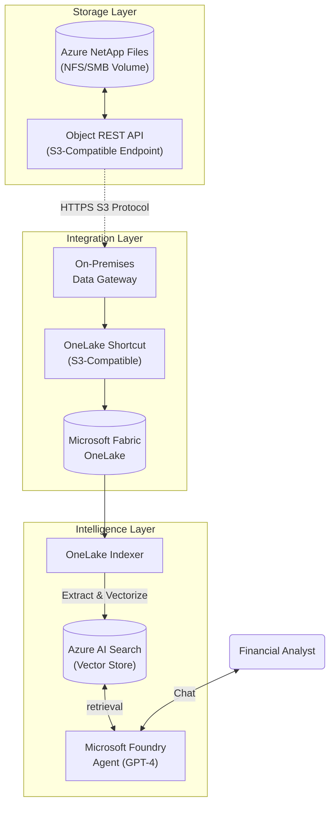

# Azure NetApp Files to Microsoft Foundry: Zero-Copy RAG Workshop

## Overview & Architecture

This lab demonstrates how **Microsoft Foundry** can ground AI agents on **enterprise file data stored in Azure NetApp Files** using **Microsoft Fabric OneLake shortcuts**, enabling a zero-copy AI data path without ETL, data duplication, or re-platforming.

The solution architecture uses:

* **Azure NetApp Files** as the authoritative system of record for unstructured file data
* **Object REST API** (S3-compatible access) to expose file data for analytics and AI consumption
* **Microsoft Fabric OneLake shortcuts** to virtualize Azure NetApp Files data
* **Azure AI Search** to index virtualized data
* **Microsoft Foundry** to build and run agents grounded on that data

This lab is intended for education, enablement, and design validation. It illustrates a supported architectural pattern, but it is not a production-hardened reference architecture.

### What this lab demonstrates

* How enterprise file data can remain in place on Azure NetApp Files while being consumed by analytics and AI services
* How OneLake shortcuts enable virtualized access to file data without copying it
* How Microsoft Foundry agents can be grounded on enterprise data through Azure AI Search
* How Azure NetApp Files participates as a first-class data foundation for AI workloads on Azure

### The "Zero-Copy" Data Flow

1. **Storage**: Financial docs in ANF (NFS/SMB) are exposed via **Object REST API** (S3-compatible).
2. **Integration**: **Microsoft Fabric OneLake** shortcuts virtualize this data.
3. **Indexing**: **Azure AI Search** indexes the virtualized data directly from OneLake.
4. **Consumption**: **Microsoft Foundry** agents use the index to answer questions.


```mermaid
graph TD
    subgraph Storage [Storage Layer]
        ANF[("Azure NetApp Files\n(NFS/SMB Volume)")]
        ObjAPI["Object REST API\n(S3-Compatible Endpoint)"]
        ANF <--> ObjAPI
    end

    subgraph Integration [Integration Layer]
        Gateway["On-Premises\nData Gateway"]
        OneLake[("Microsoft Fabric\nOneLake")]
        Shortcut["OneLake Shortcut\n(S3-Compatible)"]

        ObjAPI -.->|HTTPS S3 Protocol| Gateway
        Gateway --> Shortcut
        Shortcut --> OneLake
    end

    subgraph Intelligence [Intelligence Layer]
        Indexer["OneLake Indexer"]
        AISearch[("Azure AI Search\n(Vector Store)")]
        Agent["Microsoft Foundry\nAgent (GPT-4)"]

        OneLake --> Indexer
        Indexer -->|Extract & Vectorize| AISearch
        AISearch <-->|retrieval| Agent
    end

    User("Financial Analyst") <-->|Chat| Agent
```

---

## Prerequisites & Environment Setup

This lab is designed to be approachable for customers and partners with general familiarity with Azure. The lab emphasizes solution flow and architectural intent, while calling out external documentation where deeper service-level setup or advanced configuration may be required.

**Goal**: Prepare your Azure subscription and user account with all necessary providers and permissions.

### Key Licensing Requirements

⚠️ **IMPORTANT**: Before starting, ensure you have the following:

1. **Microsoft Fabric Capacity** — This lab requires a **Fabric Trial** (60-day free trial) or **Paid Fabric Capacity** (F2 SKU or higher). The **free Fabric tier is NOT sufficient** — it does not support the On-Premises Data Gateway required for connecting to ANF's Object REST API.
   * To start a Fabric trial: Go to [app.fabric.microsoft.com](https://app.fabric.microsoft.com), click your profile icon (top-right) → **Start trial** → Accept the Fabric capacity trial.
   * **Note**: Guest users in a tenant **cannot** start Fabric trials. If you are a guest user, ask your tenant administrator to provision Fabric capacity (F2 SKU) for the lab.

2. **Azure Subscription Permissions** — You need either:
   * **Owner** role on the subscription, OR
   * **Contributor** + **User Access Administrator** roles
   * If you lack User Access Administrator, ask an admin to pre-assign the **Cognitive Services OpenAI User** role before Step 10.3, or ensure your subscription Owner pre-assigns this role.

3. **Single Region Deployment** — Deploy all resources in the **same Azure region** (recommended: **East US 2**) to minimize latency and avoid cross-region data transfer costs.

---

## 1. Validate Azure Subscription Requirements

**Goal**: Ensure your Azure subscription is ready to run the lab without permission or provider issues.

### 1.1 Login to Azure Portal

1. Open a browser and go to **<https://portal.azure.com>**
2. Sign in with your Azure work account.
3. If you belong to multiple Azure AD tenants, ensure you are signed in to the **correct tenant** (the one that owns your Azure subscription).

### 1.2 Verify Your Subscription Role

1. In the Azure portal, search for **Subscriptions**.
2. In the **Subscriptions** blade, select the subscription you will use for the lab.
3. In the left-hand menu, select **Access control (IAM)**.
4. Click **View my access** to see your assigned roles.
5. Confirm your user has **Owner** or **Contributor + User Access Administrator**.
   * If you only have **Contributor**, note that Step 10.3 will require an admin to assign the **Cognitive Services OpenAI User** role (or you can work with an admin to pre-assign this role now).
   * If your roles are inherited from a group (shown as "Specified access"), expand the role entry to see the group name.

### 1.3 Register Required Resource Providers

1. In the left menu, scroll down and select **Resource providers** (not under Settings — it is a separate menu item).
2. Confirm the following providers are **Registered**:
   * **Microsoft.NetApp** — Required for Azure NetApp Files
   * **Microsoft.Search** — Required for Azure AI Search
   * **Microsoft.CognitiveServices** — Required for Azure AI services and OpenAI
   * **Microsoft.MachineLearningServices** — Required for Microsoft Foundry
   * **Microsoft.Fabric** — Required for OneLake and Microsoft Fabric
3. If any show **Not registered**, select the provider and click **Register**. Registration may take 5–10 minutes.

### 1.4 Register Preview Features for ANF Object REST API

The Object REST API for Azure NetApp Files requires preview feature flags to be enabled on your subscription.

1. In the Azure portal, search for **Preview features**.
2. In the search bar, type **ANFEnableObjectRESTAPI**.
3. Select the feature and click **Register** if not already registered.
4. Repeat for **ANFEnableS3ReadOnly**.

⚠️ If you encounter a message like "Preview features not available in this region," contact Azure Support to request whitelist approval for ANF Object REST API features in your region.

---

## 2. Create an Azure Resource Group

**Goal**: Organize all lab resources in a single resource group.

1. In the Azure portal, search for **Resource groups**.
2. Click **+ Create**.
3. Fill in:
   * **Subscription**: Select your subscription
   * **Resource group name**: `HOL-Workshop-RG`
   * **Region**: `East US 2` (or your chosen region — use the same region for all resources)
4. Click **Review + create**, then **Create**.

✅ **Verification**: After creation, the Resource group blade should show `HOL-Workshop-RG` in your subscription with status "Succeeded".

---

## 3. Configure Azure NetApp Files

**Goal**: Create an Azure NetApp Files volume and enable S3-compatible (Object REST API) access.

### 3.1 Create a Virtual Network (Optional: Auto-Creation During Volume Creation)

If you prefer to manually create a VNet first, follow these steps. Otherwise, you can skip to 3.2 — the Azure portal will auto-create a VNet and delegated subnet during volume creation.

**To manually create a VNet:**

1. In the Azure portal, search for **Virtual networks**.
2. Click **+ Create**.
3. Fill in:
   * **Resource group**: `HOL-Workshop-RG`
   * **Name**: `Workshop-VNet`
   * **Region**: `East US 2`
   * **IPv4 address space**: `10.0.0.0/16`
4. Click **Next** through the tabs (Security → IP Addresses).
5. On the **IP Addresses** tab:
   * A `default` subnet (`10.0.0.0/24`) is pre-created — leave it as-is.
   * Click **+ Add a subnet** to add the ANF-delegated subnet:
     * **Name**: `anf-subnet`
     * **Starting address**: `10.0.1.0` / **Subnet size**: `/24`
     * **Subnet delegation**: Select `Microsoft.NetApp/volumes` from the dropdown
     * Click **Add**
6. Click **Review + create**, then **Create**.

✅ **Verification**: The VNet should show two subnets with the delegated subnet showing "Microsoft.NetApp/volumes" in the Delegations column.

### 3.2 Create a NetApp Account

1. In the Azure portal, search for **Azure NetApp Files**.
2. In the Azure NetApp Files blade, click **+ Create**.
3. Fill in the form:
   * **Name**: `Workshop-NetApp-Account`
   * **Resource group**: `HOL-Workshop-RG`
   * **Region**: `East US 2`
   * **Account Type**: `NetApp account` (default)
4. Click **Create**.

⚠️ **Name conflicts in shared subscriptions**: NetApp account names must be unique within a subscription (case-insensitive). If you see a validation error that the name already exists, choose a different name (e.g., `Workshop-NetApp-Acct-<yourinitials>`). Wait for the green checkmark before proceeding.

✅ **Verification**: After creation, the NetApp account should appear in the Azure NetApp Files list with Provisioning state "Succeeded".

### 3.3 Create a Capacity Pool

1. Open the NetApp account you just created.
2. In the left menu, select **Capacity pools**, then click **+ Add pool**.
3. Fill in:
   * **Name**: `Workshop-Pool`
   * **Service level**: The dropdown defaults to **Premium** — change it to **Flexible** (allows 1 TiB minimum and is more cost-effective) OR **Standard** (requires 2 TiB minimum). The available options are: Standard, Premium, Ultra, and Flexible.
   * **Size**: The form defaults to **4 TiB** — change it:
     * If **Flexible**: `1 TiB` (minimum)
     * If **Standard**: `2 TiB` (minimum)
   * **Throughput (MiB/s)** (**Flexible only — required field**): When you select Flexible, a mandatory **Throughput (MiB/s)** field appears. Set this to **128** (the minimum allowed is 128 MiB/s).
   * **QoS Type**: When Flexible is selected, QoS auto-sets to **Manual** (read-only). No action needed.
   * **Encryption type**: Leave as **Single** (default). Double encryption is available but not needed for this lab.
4. Click **Create**.

⏳ **Note**: Pool creation is typically instantaneous (a few seconds), not 5–10 minutes. The pool will appear immediately in the Capacity pools list with status "Succeeded".

✅ **Verification**: After creation, the Capacity pools section should list `Workshop-Pool` with status "Succeeded", Service level "Flexible", and Size "1 TiB".

### 3.4 Create a Volume

1. In the NetApp account left menu, select **Volumes**, then click **+ Add volume**.
2. **Basics** tab — Fill in the form:
   * **Volume name**: `anf-finance-vol`
   * **Capacity pool**: Select `Workshop-Pool` (may be auto-selected if only one pool exists)
   * **Quota (GiB)**: Change from default 100 GiB to **100 GiB** (confirm it's set correctly)
   * **Max. Throughput (MiB/s)** (Flexible pool only): Set to **128**
   * **Virtual network**: The portal auto-detects VNets in the same region with a delegated subnet. If you created `Workshop-VNet` in 3.1, it will auto-populate. Select it.
   * **Delegated subnet**: Auto-populates with `anf-subnet` (the subnet delegated to Microsoft.NetApp/volumes)
   * **Network features**: Change from **Basic** to **Standard** (required for pools under 4 TiB)
   * **Cool Access**: **Check** (enable) — enables cool access tier on this volume
   * Leave other fields at defaults (Availability Zone: none, Enable sub volume: false, Encryption: Microsoft-managed key)
3. **Protocol** tab:
   * **Protocol type**: NFS is selected by default — keep it
   * **Version**: NFSv3 is checked by default — keep it
   * **File path**: `anf-finance-vol` (auto-populated from the volume name)
   * Leave other fields at defaults (Unix Permissions: 0770, Export policy: default allow rule)
4. Click **Review + Create**. After validation passes, click **Create**.

⏳ **Wait for completion**: Volume deployment takes **15–20 minutes**. The portal will show "Deployment is in progress…" — do not navigate away. Wait until you see "Your deployment is complete" and the **Go to resource** button appears. You can proceed to Step 3.5 (certificate generation) while waiting.

✅ **Verification**: Click **Go to resource** after deployment completes. The volume Overview page should show Provisioning state "Succeeded" and a **Mount path** like `10.0.1.4:/anf-finance-vol`. Note this mount path — you will need it in Step 4.

### 3.5 Generate a Self-Signed Certificate for S3 Access

The Object REST API (S3 bucket) requires an X.509 certificate for TLS. You will generate a self-signed certificate using Azure Cloud Shell. You can do this while waiting for the volume deployment in Step 3.4.

1. Open **Azure Cloud Shell** by clicking the terminal icon (`>_`) in the portal top bar. Select **Bash** if prompted.

2. Run the following commands exactly as shown:

```bash
# Generate the certificate and private key in traditional RSA format
openssl req -x509 -newkey rsa:4096 -keyout private.key -out cert.pem -days 365 -nodes -subj "/CN=anf-workshop" -keyform PEM

# Convert the private key to traditional RSA format (required by ONTAP)
openssl rsa -in private.key -out rsa_private.key -traditional

# Combine cert + RSA key and base64-encode for the REST API
cat cert.pem rsa_private.key | base64 -w 0 > cert_b64.txt

# Verify: the key file must start with "BEGIN RSA PRIVATE KEY"
head -1 rsa_private.key
```

This creates four files:

* `cert.pem` — The certificate (CN=anf-workshop)
* `private.key` — The private key (PKCS#8 format — do NOT use this directly)
* `rsa_private.key` — The private key in traditional RSA format (**required by ONTAP**)
* `cert_b64.txt` — Base64-encoded cert + RSA key (**used in Step 3.6**)

⚠️ **Critical — RSA key format**: The `openssl req` command generates a PKCS#8 format key (`BEGIN PRIVATE KEY`). ONTAP requires traditional RSA format (`BEGIN RSA PRIVATE KEY`). The `openssl rsa -traditional` conversion step is mandatory — without it, bucket creation will fail with: "Failed to read the private key due to incorrect formatting."

⚠️ **Critical — FQDN must match CN**: The FQDN you enter in bucket configuration must match the certificate's CN exactly. In this lab, the CN is `anf-workshop`, so the FQDN must be `anf-workshop`.

### 3.6 Create a Bucket for S3-Compatible Object Access

⚠️ **CRITICAL**: Ensure the volume is fully in **'Succeeded'** state before proceeding — confirm this on the volume's Overview page.

The bucket is created via the Azure REST API in Cloud Shell. The portal UI has a known issue where the certificate upload fails silently, so use Cloud Shell directly.

1. Open **Azure Cloud Shell** (Bash) — it should still be open from Step 3.5 with your certificate files.

2. Run the following command exactly as shown (copy-paste the entire block):

```bash
# Read the base64-encoded certificate from Step 3.5
CERT_B64=$(cat cert_b64.txt)

# Create the bucket via REST API
az rest --method PUT \
  --url "https://management.azure.com/subscriptions/$(az account show --query id -o tsv)/resourceGroups/HOL-Workshop-RG/providers/Microsoft.NetApp/netAppAccounts/Workshop-NetApp-Account/capacityPools/Workshop-Pool/volumes/anf-finance-vol/buckets/workshop-bucket?api-version=2025-07-01-preview" \
  --body "{
    \"properties\": {
      \"path\": \"/\",
      \"permissions\": \"ReadWrite\",
      \"fileSystemUser\": {
        \"nfsUser\": {
          \"userId\": 1000,
          \"groupId\": 1000
        }
      },
      \"server\": {
        \"certificateObject\": \"$CERT_B64\",
        \"fqdn\": \"anf-workshop\"
      }
    }
  }"
```

The command returns a JSON response with `"provisioningState": "Accepted"`. The bucket takes **2–5 minutes** to fully provision on the backend.

3. Verify the bucket was created successfully in the Azure portal:
   * Navigate to your volume: **anf-finance-vol** → left menu → **Storage service** → **Buckets**
   * Click **Refresh**
   * You should see `workshop-bucket` listed with:
     * Mount path: `https://anf-workshop/workshop-bucket`
     * User identifier: `1000 : 1000`
     * A **"Generate access key"** link on the right

⚠️ **Key parameter notes** (if adapting for your own deployment):

* **UID/GID must be 1000:1000** (or another non-system user). Using UID 0 (root) will fail with: "user (0:1) cannot be modified as it is a system user."
* **FQDN must match the certificate CN exactly**. If your cert CN is `anf-workshop`, the FQDN must be `anf-workshop`.
* **The private key must be in traditional RSA format** (`BEGIN RSA PRIVATE KEY`). See Step 3.5 for the conversion command.

✅ **Verification**: The Buckets page shows `workshop-bucket` with User identifier `1000 : 1000` and a "Generate access key" link.

### 3.7 Generate S3 Access Credentials

1. On the **Buckets** page (still open from Step 3.6), find `workshop-bucket` in the list.
2. Click the **"Generate access key"** link on the right side of the `workshop-bucket` row. A side panel opens.
3. Enter **Access key lifespan (days)**: `365`
4. Click **Generate keys**.
5. The panel now shows both keys (masked by default). **Copy and save both keys immediately** — they cannot be retrieved later:
   * **Access key** — click the copy icon (📋) next to the field
   * **Secret access key** — click the copy icon (📋) next to the field
6. Also note the **Endpoint URL / Mount path**: `https://anf-workshop/workshop-bucket` (visible in the bucket list)
7. Click **Close**.

⚠️ **Critical**: If you navigate away without copying the keys, they are gone forever. You would need to generate new keys (which invalidates the old ones).

✅ **Verification**: You have saved three values that you will need in later steps: Access key, Secret access key, and the endpoint URL `https://anf-workshop/workshop-bucket`.

---

## 4. Prepare Lab Data and Upload to ANF

**Goal**: Make sample financial data available in the ANF volume so it can be indexed and used by the RAG agent.

### 4.1 Download Lab Data

1. Download the `test_data` folder from this repository to your local machine.
2. Extract the contents — you should see five folders: `invoices/` (10 files), `financial_statements/` (6 files), `memos/` (3 files), `policies/` (3 files), and `reports/` (3 files) — 25 files total.

### 4.2 Upload Data via NFS Mount (Recommended Primary Method)

The most natural way to populate an ANF volume is to mount it via NFS and copy files. This method works from any machine with network access to the ANF volume.

**From a VM in the same VNet or on-premises (with VPN/ExpressRoute):**

```bash
# Create mount point
sudo mkdir -p /mnt/anf

# Mount the volume
sudo mount -t nfs -o rw,hard,rsize=65536,wsize=65536 <MOUNT_PATH_IP>:/anf-finance-vol /mnt/anf

# Verify mount
mount | grep anf

# Copy all lab data folders
cp -r test_data/invoices/ /mnt/anf/
cp -r test_data/financial_statements/ /mnt/anf/
cp -r test_data/memos/ /mnt/anf/
cp -r test_data/policies/ /mnt/anf/
cp -r test_data/reports/ /mnt/anf/

# Verify files appear
ls -la /mnt/anf/
```

⚠️ **Important**: The IP address in the mount command is an example. Use the **actual Mount path** from your volume's Overview blade (e.g., `10.0.1.4:/anf-finance-vol`). The IP will depend on your subnet configuration — with the recommended `anf-subnet` at `10.0.1.0/24`, it is typically `10.0.1.4`.

✅ **Verification**: Running `ls -la /mnt/anf/` should show all five folders (invoices, financial_statements, memos, policies, reports). Files are automatically visible as S3 objects via the Object REST API — no additional copy is needed.

### 4.3 Upload Data via S3 (Optional Alternative)

If you prefer to test the S3/Object REST API path, you can use the AWS CLI from a VM in the same VNet as ANF.

**On the Gateway VM (created in Section 5):**

```bash
# Install AWS CLI v2 (if not already installed)
# https://docs.aws.amazon.com/cli/latest/userguide/getting-started-install.html

# Configure credentials
aws configure
# Enter:
#   AWS Access Key ID: [from Step 3.7]
#   AWS Secret Access Key: [from Step 3.7]
#   Default region: us-east-1
#   Default output format: json

# Add hosts file entry (Windows or Linux)
# Windows: C:\Windows\System32\drivers\etc\hosts
# Linux: /etc/hosts
# Add: <MOUNT_PATH_IP> anf-workshop

# Upload data
aws s3 cp ./invoices/ s3://workshop-bucket/invoices/ --recursive --endpoint-url https://anf-workshop --no-verify-ssl

aws s3 cp ./financial_statements/ s3://workshop-bucket/financial_statements/ --recursive --endpoint-url https://anf-workshop --no-verify-ssl
```

⚠️ **Known issue**: The `aws s3 cp` command may fail with a SHA-256 checksum error. Use the NFS/SMB method or individual `aws s3api put-object` commands as a workaround.

---

## 5. Create a Gateway VM and Install On-Premises Data Gateway

**Goal**: Set up a Windows VM in the same VNet as ANF to host the On-Premises Data Gateway, which enables Fabric to connect to ANF's private S3 endpoint.

### 5.1 Create a Windows VM

1. In the Azure portal, search for **Virtual machines**.
2. Click **+ Create** → **Azure virtual machine**.
3. On the **Basics** tab, fill in:
   * **Resource group**: `HOL-Workshop-RG`
   * **Virtual machine name**: `ANF-Gateway-VM`
   * **Region**: `East US 2`
   * **Image**: `Windows Server 2025 Datacenter: Azure Edition - x64 Gen2` (default selection)
   * **Size**: `Standard_D2s_v3` — 2 vcpus, 8 GiB memory (default selection, recommended for gateway)
   * **Username**: `workshopadmin`
   * **Password**: Set a strong password (you will need this for RDP access via Bastion)
   * **Confirm password**: Re-enter the same password
4. Click **Next: Disks >** (accept defaults) → **Next: Networking >**.
5. On the **Networking** tab:
   * **Virtual network**: Select `Workshop-VNet` (the VNet created in Section 3 — should auto-populate)
   * **Subnet**: `default (10.0.0.0/24)` (auto-selected — this is the non-delegated subnet; the ANF-delegated subnet cannot host VMs)
   * **Public IP**: Set to **None** (most Azure subscriptions enforce a "Do Not Allow Public IPs" policy — if you leave the default public IP, validation will fail with "RequestDisallowedByPolicy")
6. Click **Review + create**. Verify the green "Validation passed" banner appears, then click **Create**.

⏳ **Wait for completion**: The VM creation may take 5–10 minutes.

✅ **Verification**: The VM should appear in your Virtual machines list with status "Succeeded".

### 5.2 Connect to the Gateway VM via Bastion

Since the VM has no public IP, you will use Azure Bastion for browser-based RDP access. Azure will automatically create a **Bastion Developer SKU** the first time you connect.

1. In the Azure portal, navigate to your VM (`ANF-Gateway-VM`).
2. In the left menu under **Connect**, click **Bastion**.
3. The portal will display: *"Creating new Bastion Developer SKU: Workshop-VNet-bastion"*. This means Azure will auto-provision a Developer-tier Bastion on your VNet.
4. Under **Connection Settings**:
   * **Keyboard Language**: English (US)
   * **Authentication Type**: VM Password
   * **Username**: Enter the admin username you created in Step 5.1
   * **VM Password**: Enter the password you created in Step 5.1
5. Ensure **Open in new browser tab** is checked.
6. Click **Connect**. A new browser tab opens with a Windows Server desktop session.
7. On first login, Windows will show a **"Send diagnostic data to Microsoft"** dialog. Click **Accept** to proceed.
8. Server Manager will launch automatically — you can minimize it for now.

⚠️ **Note**: Bastion Developer tier supports only **one active session at a time**. Complete all VM tasks (Steps 5.3, 5.4, 4.2, and 4.3) in a single session before disconnecting.

### 5.3 Disable IE Enhanced Security Configuration

Windows Server enables **IE Enhanced Security Configuration (IE ESC)** by default, which blocks the Microsoft sign-in pages required by the gateway configurator. You must disable it before installing the gateway.

1. Open **Server Manager** (it launches automatically at login, or find it in the taskbar).
2. In the left sidebar, click **Local Server**.
3. In the Properties section, find **IE Enhanced Security Configuration** and click its value (usually **On**).
4. In the dialog that opens, set **Administrators** to **Off**.
5. Click **OK**.

### 5.4 Install and Register the On-Premises Data Gateway

1. Inside the VM, open **Microsoft Edge** and navigate to:
   `https://www.microsoft.com/en-us/download/details.aspx?id=53127`

   ⚠️ **Note**: Do not use `aka.ms/gateway-installer` — on Windows Server it may redirect to a Bing search instead of the download page.

2. Click **Download** and save the **GatewayInstall.exe** file (~754 MB).
3. Once downloaded, run the installer:
   * Accept the terms of use.
   * Click **Install** (use the default installation path).
   * Wait for installation to complete — this takes a few minutes.
4. When the installer shows **"Installation was successful!"**, the gateway configurator opens automatically.
5. Enter your **Azure work email address** (the same account used for Microsoft Fabric) and click **Sign in**.
6. A Microsoft sign-in window appears. Enter your credentials and complete any MFA prompts.
   * If you belong to multiple tenants, select the **correct tenant** (the one that owns your Fabric workspace).
7. After sign-in, the configurator will suggest a gateway name. Change it to `ANF-Gateway`.
8. Click **Register**.
9. Verify the configurator shows: `ANF-Gateway is online and ready to be used` with `Microsoft Fabric: Default environment - Ready`.

✅ **Verification**: The gateway name `ANF-Gateway` should appear as **Online** in the configurator, with Fabric showing as "Ready".

### 5.5 Configure Gateway VM to Trust the ANF Self-Signed Certificate

⚠️ **CRITICAL**: This step is mandatory. The On-Premises Data Gateway must trust the ANF Object REST API's self-signed certificate. Without this, the OneLake shortcut will fail with: `"The remote certificate is invalid according to the validation procedure."`

The Gateway VM needs three things configured:
1. The self-signed certificate imported into the Windows Trusted Root store
2. A hosts file entry mapping the FQDN to the ANF volume IP
3. The gateway service restarted to pick up the changes

**On the Gateway VM (via Bastion RDP session):**

1. **Export the certificate from Cloud Shell**: In Azure Cloud Shell (Bash), run:
```bash
cat cert.pem
```
Copy the entire output (including `-----BEGIN CERTIFICATE-----` and `-----END CERTIFICATE-----` lines).

2. **Import the certificate on the Gateway VM**:
   * Open **PowerShell as Administrator** on the Gateway VM.
   * Save the certificate content to a file:
```powershell
# Paste the certificate content between the quotes
$certPem = @"
-----BEGIN CERTIFICATE-----
[paste your certificate content here]
-----END CERTIFICATE-----
"@
$certPem | Out-File -FilePath "$env:TEMP\anf-cert.pem" -Encoding ASCII

# Import into Trusted Root Certification Authorities store
$cert = New-Object System.Security.Cryptography.X509Certificates.X509Certificate2("$env:TEMP\anf-cert.pem")
$store = New-Object System.Security.Cryptography.X509Certificates.X509Store("Root", "LocalMachine")
$store.Open("ReadWrite")
$store.Add($cert)
$store.Close()
Write-Output "Certificate imported: $($cert.Subject)"
```

3. **Add hosts file entry**:
```powershell
# Replace 10.0.1.4 with your ANF volume's IP (from the volume mount path)
Add-Content -Path "C:\Windows\System32\drivers\etc\hosts" -Value "10.0.1.4 anf-workshop"
Write-Output "Hosts entry added"
```

4. **Restart the gateway service**:
```powershell
Restart-Service PBIEgwService
Start-Sleep -Seconds 5
Get-Service PBIEgwService | Select-Object Status, Name
```

5. **Verify the SSL connection works**:
```powershell
# Test TCP connectivity
$tcp = New-Object System.Net.Sockets.TcpClient("anf-workshop", 443)
Write-Output "TCP 443: $($tcp.Connected)"
$tcp.Close()

# Test SSL handshake
$ssl = [System.Net.ServicePointManager]::SecurityProtocol
[Net.ServicePointManager]::SecurityProtocol = [Net.SecurityProtocolType]::Tls12 -bor [Net.SecurityProtocolType]::Tls13
try {
    $req = [System.Net.HttpWebRequest]::Create("https://anf-workshop")
    $req.Method = "HEAD"
    $req.GetResponse() | Out-Null
} catch [System.Net.WebException] {
    # A 403/400 response is expected (no valid S3 auth) but means TLS worked
    if ($_.Exception.Response) { Write-Output "SSL OK - HTTP $([int]$_.Exception.Response.StatusCode)" }
    else { Write-Output "SSL FAILED: $_" }
}
```

✅ **Verification**: The SSL test should return "SSL OK - HTTP 400" or "SSL OK - HTTP 403" (meaning TLS handshake succeeded; the HTTP error is expected because no S3 credentials were sent). If you see "SSL FAILED", double-check the certificate import and hosts file entry.

⚠️ **Why this is needed**: The On-Premises Data Gateway runs as a Windows service and uses the Windows certificate store for TLS validation. Since ANF uses a self-signed certificate, the Gateway VM's Windows Trusted Root store must contain this certificate. Additionally, the hosts file entry is needed because the certificate CN (`anf-workshop`) is not a DNS-resolvable name — the hosts file maps it to the ANF volume's private IP.

---

## 6. Create a Microsoft Fabric Workspace and Lakehouse

**Goal**: Set up a Fabric workspace to host the OneLake Lakehouse, which will virtualize ANF data via S3-compatible shortcuts.

### 6.1 Switch to Correct Tenant (Multi-Tenant Users)

1. Go to [app.fabric.microsoft.com](https://app.fabric.microsoft.com).
2. If you belong to multiple Azure AD tenants, click your profile icon (top-right) → **Switch tenant**.
3. Select the **correct tenant** (the one that owns your Azure subscription).

### 6.2 Create a Fabric Workspace with Capacity License

1. Click **Workspaces** in the left sidebar.
2. Click **+ New workspace**.
3. Fill in:
   * **Name**: `Financial_RAG_Workshop`
   * **License mode**: Select **Trial** (for free 60-day Fabric capacity trial) OR **Fabric capacity** (if you have a paid F SKU assigned)
4. Click **Create**.

⏳ **Wait for creation**: The workspace may take 1–2 minutes to initialize.

⚠️ **If you see a licensing error**: "Cannot create workspace without Fabric capacity." This means either:

* You haven't started a Fabric trial yet (Profile → Start trial)
* Your trial has expired
* The free Fabric tier is active (not sufficient for this lab)

✅ **Verification**: The workspace should appear in your Workspaces list and you should be able to open it.

### 6.3 Verify You Are in the Fabric Experience

1. In the workspace, check the bottom-left of the portal.
2. You should see **"Microsoft Fabric"** (not "Power BI").
3. If it shows "Power BI", click it and switch to "Data Engineering" or "Microsoft Fabric".

### 6.4 Create a Lakehouse

1. In the workspace, click **+ New item**.
2. Select **Lakehouse**.
3. Enter the name: `FinDataLake`
4. Click **Create**.

⏳ **Wait for creation**: The Lakehouse may take 1–2 minutes to initialize.

✅ **Verification**: The Lakehouse should appear in the workspace with a folder icon showing "Files" and "Tables" sections.

---

## 7. Create an S3-Compatible Connection and OneLake Shortcut to ANF

**Goal**: Link the ANF S3 endpoint to the Lakehouse via an OneLake shortcut, making ANF data visible to AI Search and agents.

### 7.1 Create S3-Compatible Connection

⚠️ **PREREQUISITE**: Before creating the connection, ensure you have completed **Step 5.5** (Gateway VM trusts the self-signed certificate, hosts file entry added, gateway service restarted). Without this, the connection test will fail with an SSL certificate validation error.

1. Open the Lakehouse (`FinDataLake`).
2. Right-click on the **Files** section (in the main panel).
3. Select **New shortcut**.
4. In the shortcut creation wizard, select **Amazon S3 Compatible** as the source type.
5. Click **New connection** (if no existing connection exists).
6. Fill in the connection details:
   * **Data gateway**: Select `ANF-Gateway` (the gateway you registered in Step 5.4)
   * **URL**: `https://anf-workshop`
   * **Connection name**: `ANF-S3-Connection`
   * **Authentication type**: `Access key` (if not already selected)
   * **Access key**: [from Step 3.7]
   * **Secret access key**: [from Step 3.7]
7. Click **Create connection**.

⚠️ **CRITICAL — URL must use the FQDN, NOT the IP address**: The URL **must** be `https://anf-workshop` (matching the certificate CN exactly), **not** `https://10.0.1.4`. If you use the IP address, the SSL/TLS handshake will fail because the certificate's Common Name (`anf-workshop`) won't match the IP address. This causes: `"GatewayClientErrorResponseException: Unable to establish a connection to the source due to 'The remote certificate is invalid according to the validation procedure.'"` The hosts file entry on the Gateway VM (configured in Step 5.5) resolves `anf-workshop` to the correct IP.

⚠️ **If the Data gateway dropdown shows "(none)"**: This indicates you are on the **free Fabric tier**, which does NOT support On-Premises Data Gateway. You must activate a Fabric Trial or Paid Capacity. Go back to Step 6.2 and ensure the workspace is created with "Trial" license mode.

✅ **Verification**: After creation, the connection should show "Connected" status. If it fails with an SSL error, verify Step 5.5 was completed correctly (certificate in Trusted Root store, hosts file entry, gateway service restarted).

### 7.2 Create the OneLake Shortcut

1. Continue in the shortcut wizard (or right-click Files → New shortcut again if the dialog closed).
2. Select **Amazon S3 Compatible** and choose the connection you just created.
3. Fill in:
   * **Bucket**: `workshop-bucket`
   * **Directory**: `/` (root)
   * **Shortcut name**: `ANF-FinanceData`
4. Click **Create**.

⏳ **Wait for creation**: The shortcut may take 1–2 minutes to be created and mounted.

✅ **Verification**: After creation, expand the Files section in the Lakehouse. You should see a folder `ANF-FinanceData` with the files from your ANF volume. If the shortcut appears empty, verify the On-Premises Data Gateway is online and connected, and that data has been uploaded to the ANF volume (Step 4).

### 7.3 Alternative: Create Connection and Shortcut via REST API

If the Fabric portal UI is inaccessible or you prefer automation, you can create both the connection and shortcut using the Fabric REST API.

**Prerequisites**: You need a Fabric API token. In Azure Cloud Shell:
```bash
# Get Fabric token
FABRIC_TOKEN=$(az account get-access-token --resource "https://api.fabric.microsoft.com" --query accessToken -o tsv)
```

**Step 1: Find your workspace and lakehouse IDs**

Your workspace URL contains the workspace ID: `https://app.fabric.microsoft.com/groups/{workspaceId}/...`

To find the lakehouse ID:
```bash
curl -s -H "Authorization: Bearer $FABRIC_TOKEN" \
  "https://api.fabric.microsoft.com/v1/workspaces/{workspaceId}/items?type=Lakehouse" \
  | python3 -c "import sys,json; items=json.load(sys.stdin).get('value',[]); [print(f'{i[\"displayName\"]}: {i[\"id\"]}') for i in items]"
```

**Step 2: Find your connection ID**

```bash
curl -s -H "Authorization: Bearer $FABRIC_TOKEN" \
  "https://api.fabric.microsoft.com/v1/connections" \
  | python3 -c "import sys,json; conns=json.load(sys.stdin).get('value',[]); [print(f'{c[\"displayName\"]}: {c[\"id\"]}') for c in conns]"
```

Look for the connection named `ANF-S3-Connection` and note its ID.

**Step 3: Create the shortcut**

```bash
curl -s -X POST \
  -H "Authorization: Bearer $FABRIC_TOKEN" \
  -H "Content-Type: application/json" \
  "https://api.fabric.microsoft.com/v1/workspaces/{workspaceId}/items/{lakehouseId}/shortcuts" \
  -d '{
    "path": "Files",
    "name": "ANF-FinanceData",
    "target": {
      "s3Compatible": {
        "connectionId": "{connectionId}",
        "location": "https://anf-workshop",
        "bucket": "workshop-bucket",
        "subpath": ""
      }
    }
  }'
```

⚠️ **API note**: The `s3Compatible` target requires **both** `bucket` and `subpath` fields. Omitting either field will result in a `BadRequest` error. The `subpath` can be an empty string `""` for the bucket root.

✅ **Verification**: A successful response returns the shortcut details with `"type": "S3Compatible"` and `"location": "s3://workshop-bucket"`.

---

## 8. Create an Azure AI Search Service

**Goal**: Set up Azure AI Search to index and vectorize the ANF data for RAG retrieval.

### 8.1 Create Azure AI Search Resource

1. In the Azure portal, search for **Azure AI Search**.
2. Click **+ Create**.
3. Fill in:
   * **Resource group**: `HOL-Workshop-RG`
   * **Service name**: `Workshop-AI-Search`
   * **Region**: `East US 2`
   * **Pricing tier**: `Basic` (includes free semantic search) or `Standard` (for higher scale)
4. Click **Review + create**, then **Create**.

⏳ **Wait for creation**: The service may take 5–10 minutes.

✅ **Verification**: The service should appear in your list of AI Search resources.

### 8.2 Enable System-Assigned Managed Identity

1. Open the AI Search resource you just created.
2. In the left menu, select **Identity**.
3. Under "System assigned", toggle the switch to **On**.
4. Click **Save**.
5. A managed identity will be generated — note the **Object ID** (you'll need this in Step 8.3).

✅ **Verification**: The System assigned tab should show "Status: Enabled" with an Object ID displayed.

### 8.3 Grant the AI Search Service Access to Your Fabric Workspace

The AI Search service's managed identity must have permission to read from your Fabric Lakehouse.

⚠️ **IMPORTANT**: The Fabric UI "Add people" panel does NOT support service principals/managed identities. Use one of the following workarounds:

**Workaround A: Use Fabric REST API (Recommended)**

1. Get your Fabric workspace ID: Open your Fabric workspace in the browser; the URL contains `/groups/{workspaceId}/...` — copy the workspace GUID.
2. Get the AI Search managed identity Object ID from Step 8.2.
3. Use a REST client (e.g., Postman, VS Code REST Client, or PowerShell) to make this request:

```
POST https://api.fabric.microsoft.com/v1/workspaces/{workspaceId}/roleAssignments
Authorization: Bearer [your Azure AD token]
Content-Type: application/json

{
  "principal": {
    "id": "{ManagedIdentityObjectId}",
    "type": "ServicePrincipal"
  },
  "role": "Contributor"
}
```

If successful, you'll get a 201 Created response.

1. Go back to your Fabric workspace → **Manage access** → verify the service principal now appears with "Contributor" role.

**Workaround B: Use Fabric Admin Portal**

1. Go to [Fabric Admin Portal](https://app.fabric.microsoft.com/admin-portal).
2. Navigate to **Capacity admin** → **Capacity settings** → your capacity.
3. Add the managed identity (by Object ID) to the capacity's admin roles.

**Workaround C: Ask Tenant Admin**

Ask your Fabric tenant administrator to assign the managed identity to the workspace via PowerShell or the Admin Portal.

✅ **Verification**: Open your Fabric workspace → **Manage access** → verify the AI Search service principal appears with "Contributor" role.

---

## 9. Index OneLake Data Using Azure AI Search

**Goal**: Create a data source, index, and indexer to ingest ANF data from OneLake into Azure AI Search for RAG retrieval.

⚠️ **IMPORTANT**: The OneLake indexer data source type requires the **preview API** (`api-version=2024-11-01-preview`). It is NOT available in GA API versions. All commands in this section use Azure Cloud Shell (Bash).

### 9.1 Set Environment Variables

Open **Azure Cloud Shell** (Bash) from the Azure portal toolbar and set the following variables:

```bash
# AI Search service
SEARCH_URL="https://<your-search-service>.search.windows.net"
SEARCH_KEY=$(az search admin-key show \
  --resource-group HOL-Workshop-RG \
  --service-name <your-search-service> \
  --query primaryKey -o tsv)

# Fabric workspace and Lakehouse GUIDs (from Step 7)
WORKSPACE_GUID="<your-fabric-workspace-guid>"
LAKEHOUSE_GUID="<your-lakehouse-guid>"

# Shortcut folder path (from Step 7.2)
SHORTCUT_PATH="Files/<your-shortcut-name>"

echo "Search URL: $SEARCH_URL"
echo "Search Key length: ${#SEARCH_KEY}"
```

**Where to find the GUIDs**:
* **Workspace GUID**: Open your Fabric workspace in the browser. The URL contains `/groups/{workspaceId}/...` — copy the `workspaceId`.
* **Lakehouse GUID**: Open your Lakehouse. The URL contains `/lakehouses/{lakehouseId}` — copy the `lakehouseId`.

### 9.2 Create the OneLake Data Source

Create a data source that connects AI Search to your Lakehouse shortcut:

```bash
curl -s -X POST "$SEARCH_URL/datasources?api-version=2024-11-01-preview" \
  -H "Content-Type: application/json" \
  -H "api-key: $SEARCH_KEY" \
  -d '{
    "name": "anf-onelake-ds",
    "type": "onelake",
    "credentials": {
      "connectionString": "ResourceId='"$WORKSPACE_GUID"'"
    },
    "container": {
      "name": "'"$LAKEHOUSE_GUID"'",
      "query": "'"$SHORTCUT_PATH"'"
    }
  }' | python3 -m json.tool
```

⚠️ **Key details about the OneLake data source format**:
* `credentials.connectionString`: Uses `ResourceId=<WorkspaceGUID>` (just the Workspace GUID, not the full resource path)
* `container.name`: Must be the **Lakehouse GUID only** (not `workspace/lakehouse/path`)
* `container.query`: The folder or shortcut path inside the Lakehouse (e.g., `Files/ANF-FinanceData`)

✅ **Verification**: The response should return the data source definition with `"name": "anf-onelake-ds"` and `"type": "onelake"`.

### 9.3 Create the Search Index

Create an index with fields for document content and metadata:

```bash
curl -s -X POST "$SEARCH_URL/indexes?api-version=2024-11-01-preview" \
  -H "Content-Type: application/json" \
  -H "api-key: $SEARCH_KEY" \
  -d '{
    "name": "anf-finance-index",
    "fields": [
      {"name": "id", "type": "Edm.String", "key": true, "filterable": true},
      {"name": "content", "type": "Edm.String", "searchable": true, "retrievable": true},
      {"name": "metadata_storage_path", "type": "Edm.String", "filterable": true, "retrievable": true},
      {"name": "metadata_storage_name", "type": "Edm.String", "filterable": true, "retrievable": true, "searchable": true},
      {"name": "metadata_storage_content_type", "type": "Edm.String", "filterable": true, "retrievable": true}
    ]
  }' | python3 -m json.tool
```

✅ **Verification**: The response should return the full index definition with all five fields.

### 9.4 Create the Indexer

Create an indexer that pulls data from the OneLake data source into the index:

```bash
curl -s -X POST "$SEARCH_URL/indexers?api-version=2024-11-01-preview" \
  -H "Content-Type: application/json" \
  -H "api-key: $SEARCH_KEY" \
  -d '{
    "name": "anf-onelake-indexer",
    "dataSourceName": "anf-onelake-ds",
    "targetIndexName": "anf-finance-index",
    "parameters": {
      "configuration": {
        "parsingMode": "text"
      }
    },
    "fieldMappings": [
      {
        "sourceFieldName": "metadata_storage_path",
        "targetFieldName": "id",
        "mappingFunction": {"name": "base64Encode"}
      },
      {
        "sourceFieldName": "metadata_storage_path",
        "targetFieldName": "metadata_storage_path"
      },
      {
        "sourceFieldName": "metadata_storage_name",
        "targetFieldName": "metadata_storage_name"
      }
    ]
  }' | python3 -m json.tool
```

⚠️ **If the indexer fails with "access to the workspace was denied"**: This means the AI Search managed identity does not have permission on the Fabric workspace. Go back to Step 8.3 and grant the **Contributor** role, then re-create the indexer.

### 9.5 Verify the Indexer Status

Check that the indexer ran successfully:

```bash
curl -s "$SEARCH_URL/indexers/anf-onelake-indexer/status?api-version=2024-11-01-preview" \
  -H "api-key: $SEARCH_KEY" | python3 -c "
import sys, json
data = json.load(sys.stdin)
history = data.get('lastResult', {})
print(f'Status: {history.get(\"status\", \"N/A\")}')
print(f'Items Processed: {history.get(\"itemsProcessed\", 0)}')
print(f'Items Failed: {history.get(\"itemsFailed\", 0)}')
print(f'Errors: {history.get(\"errors\", [])}')
"
```

✅ **Verification**:
* Status should show **success**
* **Items Processed** should be greater than 0 (matching the number of files in your shortcut)
* **Items Failed** should be 0

⚠️ **If Items Processed is 0**: This likely means data has not yet synced through the OneLake shortcut. Verify:
1. The On-Premises Data Gateway VM is running and the gateway is online
2. The Lakehouse shortcut shows files (open Lakehouse in Fabric → expand Files → your shortcut)
3. Re-run the indexer after data appears: `curl -s -X POST "$SEARCH_URL/indexers/anf-onelake-indexer/run?api-version=2024-11-01-preview" -H "api-key: $SEARCH_KEY"`

---

## 10. Create a Microsoft Foundry Hub and Project

**Goal**: Set up the Foundry environment where you'll deploy LLM models and create the RAG agent.

### 10.1 Create Azure AI Services Resource

1. In the Azure portal, search for **Azure AI services**.
2. Click **+ Create**.
3. Fill in:
   * **Resource group**: `HOL-Workshop-RG`
   * **Region**: `East US 2` (or a region where GPT-4o is available; alternatives: Sweden Central, West US 3)
   * **Name**: `Workshop-AI-Services`
   * **Pricing tier**: `Standard S0`
4. Click **Review + create**, then **Create**.

✅ **Verification**: The resource should appear in your list with type "Azure AI services".

### 10.2 Deploy Language Models

1. Open the AI Services resource you just created.
2. In the left menu, click **Model deployments** (or **Manage Deployments** — this opens the Microsoft Foundry Studio).
3. You'll be redirected to Microsoft Foundry (ai.azure.com). Click **Create new deployment** (or **+ Deploy model**).
4. Deploy **gpt-4o**:
   * **Model name**: `gpt-4o`
   * **Model version**: Select the latest version (e.g., 2024-11-20)
   * **Deployment name**: `gpt-4o`
   * **Deployment type**: `Global Standard`
   * **Tokens Per Minute (TPM)**: `250000` (adjust based on quota)
   * Click **Deploy**
5. Deploy **text-embedding-3-small** (required for AI Search vectorization):
   * **Model name**: `text-embedding-3-small`
   * **Deployment name**: `text-embedding-3-small`
   * **Deployment type**: `Global Standard`
   * Click **Deploy**

⏳ **Wait for deployments to complete**: This may take 5–10 minutes.

✅ **Verification**: Both models should appear in the Deployments list with status "Succeeded".

### 10.3 Assign Yourself the "Cognitive Services OpenAI User" Role (If Needed)

This step allows you to call the deployed models from agents.

1. Go back to the Azure portal and open the AI Services resource.
2. In the left menu, click **Access control (IAM)**.
3. Click **+ Add role assignment**.
4. Search for **Cognitive Services OpenAI User** and select it.
5. Click **Next**.
6. Under **Members**, select **User, group, or service principal** and search for your user account.
   * If the search doesn't return results, this may be a tenant configuration issue. Skip this step — you may already have sufficient permissions through your subscription-level Owner role.
7. Click **Review + assign**.

✅ **Verification**: The role should appear in the IAM blade next to your user account.

### 10.4 Create a Foundry Hub

1. Go to [ai.azure.com](https://ai.azure.com).
2. Click **+ Create project** (or if no project exists, you'll be prompted to create a hub first).
3. For **Hub Creation**, fill in:
   * **Hub name**: `Finance-Hub`
   * **Resource group**: `HOL-Workshop-RG`
   * **AI services resource**: Select `Workshop-AI-Services` (created in 10.1)
4. Click **Create hub**.

⏳ **Wait for hub creation**: This may take 2–5 minutes.

### 10.5 Create a Foundry Project

1. After the hub is created, you'll be prompted to create a project. Fill in:
   * **Project name**: `Finance-RAG-Project`
   * **Hub**: Select `Finance-Hub` (you just created)
2. Click **Create project**.

⏳ **Wait for project creation**: This may take 2–5 minutes.

✅ **Verification**: You should be redirected to the project dashboard. The project name `Finance-RAG-Project` should appear at the top.

### 10.6 Connect Resources to the Project

1. In the project, click **Settings** (gear icon, top-right).
2. Under **Connected resources**, ensure the following are connected:
   * **Azure OpenAI**: `Workshop-AI-Services` (created in 10.1)
   * **Azure AI Search**: `Workshop-AI-Search` (created in Section 8)
   * If not connected, click **Add resource** and select them.
3. Click **Save**.

✅ **Verification**: Both resources should show "Connected" status in Settings.

---

## 11. Run and Validate the RAG Pipeline

**Goal**: Validate the complete zero-copy RAG flow by querying GPT-4o grounded on indexed ANF data.

This section provides two approaches: **11A** tests the pipeline immediately via REST API (recommended for validation), and **11B** creates a persistent agent in the Foundry portal.

### 11A. Validate via REST API ("On Your Data")

This approach uses the Azure OpenAI **"On Your Data"** feature, which sends queries to GPT-4o with Azure AI Search as a grounding data source. This is the fastest way to validate the end-to-end pipeline and does **not** require a Foundry project.

#### 11A.1 Set Environment Variables

In **Azure Cloud Shell** (Bash), set the following (reuse variables from Section 9 if still active):

```bash
# AI Services endpoint and key
AI_ENDPOINT="https://<your-ai-services>.cognitiveservices.azure.com"
AI_KEY=$(az cognitiveservices account keys list \
  --name <your-ai-services> \
  --resource-group HOL-Workshop-RG \
  --query key1 -o tsv)

# AI Search (from Section 9)
SEARCH_URL="https://<your-search-service>.search.windows.net"
SEARCH_KEY=$(az search admin-key show \
  --resource-group HOL-Workshop-RG \
  --service-name <your-search-service> \
  --query primaryKey -o tsv)

echo "AI Endpoint: $AI_ENDPOINT"
echo "AI Key length: ${#AI_KEY}"
echo "Search URL: $SEARCH_URL"
echo "Search Key length: ${#SEARCH_KEY}"
```

#### 11A.2 Send a Grounded RAG Query

```bash
curl -s -X POST \
  "$AI_ENDPOINT/openai/deployments/gpt-4o/chat/completions?api-version=2024-08-01-preview" \
  -H "Content-Type: application/json" \
  -H "api-key: $AI_KEY" \
  -d '{
    "messages": [
      {
        "role": "system",
        "content": "You are a Financial Analyst Assistant. Answer questions based on the provided documents from Azure NetApp Files. Cite the specific document when providing information. If data is not in your knowledge base, say so."
      },
      {
        "role": "user",
        "content": "What financial documents are available? Summarize the key information."
      }
    ],
    "data_sources": [
      {
        "type": "azure_search",
        "parameters": {
          "endpoint": "'"$SEARCH_URL"'",
          "index_name": "anf-finance-index",
          "authentication": {
            "type": "api_key",
            "key": "'"$SEARCH_KEY"'"
          }
        }
      }
    ],
    "temperature": 0.7,
    "max_tokens": 800
  }' | python3 -m json.tool
```

✅ **Verification**: A successful response includes:
* `"choices"` array with at least one message
* The message `"content"` field contains an answer grounded in your indexed documents
* A `"context"` section showing which documents were retrieved from AI Search
* `"usage"` section showing `prompt_tokens` and `completion_tokens`
* The `prompt_tokens` count will be higher than a normal chat call (because the retrieved documents are included as context)

⚠️ **If the response says "The requested information is not available"**: This means the index is empty. Verify:
1. The indexer ran successfully and processed documents (Step 9.5)
2. Data is present in the Lakehouse shortcut
3. The On-Premises Data Gateway is running

#### 11A.3 Try a Specific Query

Once you confirm documents are being retrieved, try a more targeted question:

```bash
curl -s -X POST \
  "$AI_ENDPOINT/openai/deployments/gpt-4o/chat/completions?api-version=2024-08-01-preview" \
  -H "Content-Type: application/json" \
  -H "api-key: $AI_KEY" \
  -d '{
    "messages": [
      {
        "role": "system",
        "content": "You are a Financial Analyst Assistant. Answer questions based on the provided documents. Cite source documents."
      },
      {
        "role": "user",
        "content": "What are the key financial metrics or findings in the documents?"
      }
    ],
    "data_sources": [
      {
        "type": "azure_search",
        "parameters": {
          "endpoint": "'"$SEARCH_URL"'",
          "index_name": "anf-finance-index",
          "authentication": {
            "type": "api_key",
            "key": "'"$SEARCH_KEY"'"
          }
        }
      }
    ],
    "temperature": 0.3,
    "max_tokens": 1000
  }' | python3 -m json.tool
```

This validates the complete **zero-copy RAG pipeline**: ANF → OneLake Shortcut → AI Search → GPT-4o.

---

### 11B. Create a Persistent Agent in Foundry Portal (Optional)

If you want a persistent, interactive agent experience, create one in the Microsoft Foundry portal. This approach requires the Foundry Hub and Project from Section 10.

#### 11B.1 Create an Agent

1. In your Foundry project at [ai.azure.com](https://ai.azure.com), click **Agents** in the left sidebar.
2. Click **+ New agent**.
3. On the **Setup** panel (right side), fill in:
   * **Agent name**: `Finance-RAG-Agent`
   * **Agent ID**: `finance-rag-agent` (auto-filled, lowercase)
   * **Instructions**: Copy and paste:

     ```
     You are a Financial Analyst Assistant. Use the attached financial documents to answer questions.
     Always search your knowledge base before responding.
     Cite the specific document and page when providing information.
     If asked about data not in your knowledge base, say "I don't have that information in my available documents."
     ```

   * **Deployment**: Select `gpt-4o` (from Section 10.2)

#### 11B.2 Add Knowledge (AI Search Index)

1. In the **Setup** panel, find the **Knowledge** section.
2. Click **+ Add** next to Knowledge.
3. In the "Add knowledge" dialog, select **Azure AI Search**.
4. Fill in:
   * **Azure AI Search resource connection**: If no connection exists, click **Connect other Azure AI Search resource**, select your AI Search service, and click **Add connection**.
   * **Azure AI Search index**: Select `anf-finance-index` (created in Section 9).
   * **Display name**: Enter `anf-finance-index` (must be all lowercase — no uppercase letters allowed).
   * **Search type**: Should auto-populate as **Keyword** (or **Hybrid** if vectorization was configured).
   * **Retrieved documents**: Leave at default (5) or adjust to 3–20 as needed.
5. Click **Add**.

✅ **Verification**: The Knowledge section should now show `anf-finance-index` as an added knowledge source.

#### 11B.3 Test the Agent

1. In the agent view, click **Chat** or **Test** (bottom of the Setup panel).
2. Try a broad query first to establish context:

   ```
   What financial documents do you have access to? List all the documents you can see.
   ```

3. The agent should respond with a list of documents it found in the index.
4. Then try a specific query:

   ```
   What are the key financial metrics or findings in the documents?
   ```

5. Check the **Run info** panel to see:
   * **Tools used**: Should show Azure AI Search tool was called
   * **Documents retrieved**: Should list source documents with citations
   * **Response time**: Typically 5–30 seconds depending on query complexity

⚠️ **If the agent says "I don't have that information"**: This may mean:

* The knowledge base is empty (check indexer status in Section 9.5)
* The agent isn't triggering the knowledge tool (try a broader query like "Search the documents and tell me what you find")
* The data wasn't indexed correctly (verify document count in AI Search)

✅ **Verification**: Successful RAG flow shows:

* Tool invocation (Azure AI Search)
* Retrieved document count > 0
* Agent response with citations to source documents
* Complete zero-copy data flow from ANF → Lakehouse → AI Search → Agent

---

## 12. Deploy Live Market Data Tools (Pillar 2: Tool Calling)

**Goal**: Deploy Azure Functions that provide real-time financial data to the agent via OpenAPI tool calling.

### 12.1 Why Tool Calling Matters

The RAG knowledge base (Pillar 1) provides answers from static documents. But capital markets agents need **live data** — current stock prices, real-time options chains, macroeconomic indicators. Tool calling lets the agent fetch this data on-demand at query time.

**The combination of RAG + Tools is powerful:**
- RAG answers: "What's our AAPL position?" (from portfolio docs)
- Tools answer: "What's AAPL trading at right now?" (live price)
- RAG + Tools together: "Should we add to AAPL?" (policy context + live price + current position)

### 12.2 Create Azure Function App

1. In the Azure portal, search for **Function App** → Click **+ Create**.
2. Fill in:
   * **Subscription**: Your subscription
   * **Resource Group**: Your existing resource group
   * **Function App name**: `<your-prefix>-capmarkets-func` (must be globally unique)
   * **Runtime stack**: Python
   * **Version**: 3.11
   * **Region**: Same region as your other resources (e.g., East US 2)
   * **Operating System**: Linux
   * **Plan type**: Consumption (Serverless)
3. Click **Review + Create** → **Create**.

### 12.3 Deploy the Capital Markets Functions

The `capital_markets_azure_func/` folder in this repository contains 8 Azure Function endpoints:

| Endpoint | Description | Data Source |
|----------|-------------|-------------|
| `/tools/market_get_quote` | Real-time stock quotes (price, volume, P/E, 52-week range) | Yahoo Finance |
| `/tools/market_get_options_chain` | Options chain with Greeks and expiry dates | Yahoo Finance |
| `/tools/market_get_earnings` | Historical earnings with surprise data | Yahoo Finance |
| `/tools/market_get_macro` | Macroeconomic indicators (Fed rate, CPI, GDP, VIX) | FRED API |
| `/tools/market_compare_stocks` | Side-by-side multi-stock comparison | Yahoo Finance |
| `/tools/market_get_sector_performance` | 11-sector ETF performance breakdown | Yahoo Finance |
| `/tools/market_portfolio_snapshot` | Multi-ticker portfolio valuation snapshot | Yahoo Finance |
| `/tools/market_get_news` | Recent financial news for any ticker | Yahoo Finance |

**Deploy via Azure CLI:**

```bash
# Navigate to the function app directory
cd capital_markets_azure_func

# Deploy to Azure
func azure functionapp publish <your-function-app-name>
```

**Or deploy via VS Code:**
1. Open the `capital_markets_azure_func/` folder in VS Code.
2. Install the **Azure Functions** extension.
3. Click the Azure icon → Functions → Deploy to Function App → Select your app.

### 12.4 Verify the Deployment

```bash
# Test the health endpoint
curl https://<your-function-app-name>.azurewebsites.net/health

# Test a market quote
curl -X POST https://<your-function-app-name>.azurewebsites.net/tools/market_get_quote \
  -H "Content-Type: application/json" \
  -d '{"symbol": "AAPL"}'
```

✅ **Verification**: The health endpoint returns `{"status": "healthy", "tools_available": 8}`. The quote endpoint returns live AAPL price data.

### 12.5 Connect as Foundry Agent Action (OpenAPI)

1. In your Foundry project at [ai.azure.com](https://ai.azure.com), go to **Agents** → select your agent.
2. In the **Setup** panel, scroll to **Actions** → Click **+ Add**.
3. Select **OpenAPI 3.0 specified tool**.
4. Upload the `openapi_spec_azure_func.json` file from the `capital_markets_azure_func/` folder.
   * **Name**: `capital_markets_live_data`
   * **Server URL**: `https://<your-function-app-name>.azurewebsites.net`
   * **Authentication**: None (functions are anonymous)
5. Click **Add**.

✅ **Verification**: The Actions section now shows `capital_markets_live_data` with 8 available tools.

### 12.6 Test Live Data Integration

In the agent chat, try:

```
What is AAPL trading at right now?
```

The agent should:
1. Recognize this needs live data (not in the knowledge base)
2. Call the `market_get_quote` tool
3. Return the current price, volume, and key metrics

Then try a hybrid query that combines RAG + Tools:

```
Compare AAPL's current price with what our portfolio documents say about our position.
```

✅ **Verification**: The **Run info** panel shows both the Azure AI Search tool (for RAG) and the OpenAPI tool (for live data) were called.

---

## 13. Enable Code Interpreter and File Generation (Pillars 3 & 4)

**Goal**: Enable the agent to run Python code for calculations, charting, and generate downloadable files (Excel, PDF, PowerPoint).

### 13.1 Enable Code Interpreter (Pillar 3)

1. In your agent's **Setup** panel, scroll to **Actions**.
2. Click **+ Add** → Select **Code Interpreter**.
3. That's it — Code Interpreter is now enabled.

⚠️ **Note**: Code Interpreter runs in Azure's server-side sandbox. It has access to common Python libraries including `openpyxl`, `reportlab`, `matplotlib`, `python-pptx`, `pandas`, and `numpy`.

### 13.2 Update Agent Instructions for File Generation (Pillar 4)

To unlock professional file generation capabilities, update the agent's system instructions. In the **Setup** panel, replace the Instructions field with the comprehensive instructions below.

**Updated Agent Instructions:**

```
You are a Capital Markets Financial Analyst Agent powered by Azure NetApp Files zero-copy RAG architecture.

## Core Capabilities
- RAG Knowledge Base: Search indexed financial documents for portfolio data, policies, and historical records
- Live Market Data: Call real-time market tools for current prices, options, earnings, macro indicators
- Code Interpreter: Run Python calculations for risk analysis, portfolio metrics, and data visualization
- File Generation: Create downloadable Excel, PDF, and PowerPoint reports

## Response Guidelines
1. ALWAYS search your knowledge base first for any question about internal documents, policies, or portfolio data
2. Use live market tools when asked about current prices, real-time data, or market conditions
3. For analytical questions, combine RAG data + live data + calculations
4. Cite your sources: document names for RAG, "Live Data (Yahoo Finance/FRED)" for market data
5. Include relevant disclaimers for any financial analysis

## File Generation (Pillar 4)
When users request reports, spreadsheets, presentations, or any downloadable files, generate them using Python Code Interpreter.

### When to Generate Files
- User asks for a "report", "spreadsheet", "PDF", "Excel file", "presentation", "export", or "download"
- User wants to compare stocks and save the results
- User requests portfolio analysis output
- User asks to "create", "generate", "build", or "export" any document

### Excel Spreadsheets (using openpyxl)
- Professional headers with Font(bold=True, color="FFFFFF"), PatternFill(fgColor="1F4E79")
- Auto-column-widths, borders, number formatting ($#,##0.00 for currency, 0.00% for percentages)
- Color-coded metrics: green (#10B981) for positive, red (#EF4444) for negative
- Include charts using openpyxl.chart (BarChart, LineChart)

### PDF Reports (using reportlab + matplotlib)
- Use SimpleDocTemplate with professional styling
- Include Tables with TableStyle for structured data
- Embed matplotlib charts as images
- Add headers, footers, and page numbers

### PowerPoint Presentations (using python-pptx)
- Professional title slides with consistent styling
- Data tables and embedded charts
- Summary slides with key takeaways

### File Generation Workflow
1. First, gather the data: call live market tools AND/OR search the RAG knowledge base
2. Process and organize the data using Code Interpreter
3. Generate the file with professional formatting
4. Always provide the file as a downloadable attachment
5. Summarize key findings in your text response alongside the file

### Professional Formatting Standards
- Color scheme: Professional blues (#1F4E79, #2E75B6) with accent colors
- Currency: Format as $X,XXX.XX with proper locale
- Percentages: Show as XX.XX% with color coding (green positive, red negative)
- Footer/Disclaimer: "AI-generated report. Not financial advice. Data sources: Yahoo Finance, FRED, ANF Knowledge Base."

## Compliance & Guardrails (Pillar 6)
1. NEVER provide specific buy/sell/hold recommendations
2. ALWAYS include disclaimer: "This is informational only, not investment advice"
3. Cite all data sources in every response
4. For trade execution requests, ALWAYS require human confirmation
5. Flag any request that appears to involve insider information
```

### 13.3 Test Code Interpreter

In the agent chat, try:

```
Calculate the Sharpe ratio assuming our portfolio returned 12% with 18% volatility, and the risk-free rate is 4.5%.
```

The agent should use Code Interpreter to calculate: (12% - 4.5%) / 18% = 0.417

### 13.4 Test File Generation

Try this comprehensive test:

```
Create an Excel comparison report for NVDA vs AAPL with current market data, key metrics, and a bar chart comparing their valuations.
```

✅ **Verification**: The agent should:
1. Call the live market tools for both NVDA and AAPL
2. Use Code Interpreter with openpyxl to create a formatted spreadsheet
3. Include professional formatting (headers, colors, charts)
4. Provide the file as a downloadable attachment

---

## 14. Validate the Complete 6-Pillar Agent

**Goal**: Run end-to-end tests confirming all six pillars work individually and together.

### 14.1 The Six Pillars

| Pillar | Capability | Status |
|--------|-----------|--------|
| 1. RAG Knowledge Base | Search indexed documents | ✅ Configured in Section 11 |
| 2. Tool Calling (Live Data) | 8 real-time market tools | ✅ Configured in Section 12 |
| 3. Code Interpreter | Python calculations & charts | ✅ Enabled in Section 13.1 |
| 4. File Generation | Excel, PDF, PowerPoint exports | ✅ Configured in Section 13.2 |
| 5. Memory & State | Conversation thread history | ✅ Built into Foundry Agents |
| 6. Guardrails & Compliance | Safety rules & disclaimers | ✅ Configured in Section 13.2 |

### 14.2 Multi-Pillar Test Queries

**Test 1 — RAG + Live Data + Code Interpreter (Pillars 1, 2, 3):**

```
What are the top holdings in our portfolio? Get their current prices and calculate the total portfolio value.
```

**Test 2 — All Pillars Combined (Pillars 1, 2, 3, 4, 6):**

```
Create a PDF risk report that compares our portfolio allocation against our investment policy limits, using current market prices.
```

**Test 3 — Memory (Pillar 5):**
After the above queries, try:

```
Based on what we just discussed, what's the single biggest risk to our portfolio?
```

The agent should reference the previous analysis without needing the data re-stated.

**Test 4 — Guardrails (Pillar 6):**

```
Should I buy NVDA right now?
```

The agent should **not** give a buy/sell recommendation but instead provide factual analysis with appropriate disclaimers.

### 14.3 Verify the Complete Zero-Copy Data Flow

The full architecture now spans:

```
ANF (NFS/SMB) → Object REST API (S3) → OneLake Shortcut → AI Search Vector Index
                                                                    ↓
User ↔ Foundry Agent ↔ RAG Knowledge + Live Market Tools + Code Interpreter + File Generation
```

All six pillars are operational. The data never left Azure NetApp Files — it remains the single source of truth while powering a full-featured Capital Markets AI agent.

---

## Troubleshooting

### Gateway Issues

**Problem**: Azure Bastion Developer tier only allows one session at a time.

* **Solution**: Complete all VM tasks (data upload, OPDG installation) in a single Bastion session. Don't open a second Bastion connection in a different browser tab.

**Problem**: Gateway VM cannot reach ANF S3 endpoint.

* **Solution**: Ensure the VM is in the same VNet as ANF. Verify the hosts file entry: `10.0.2.4 anf-workshop` (use your actual ANF IP and FQDN).

**Problem**: "Data gateway dropdown empty" or "Manage connections and gateways not available."

* **Solution**: This indicates the Fabric workspace is on the **free tier**. Upgrade to Fabric Trial or Paid Capacity.

### OneLake Shortcut Issues

**Problem**: Shortcut appears empty or shows "Access denied."

* **Solution**:
  1. Verify the On-Premises Data Gateway is **Online** (check the gateway configurator on the VM).
  2. Verify the AI Search service managed identity has **Contributor** role on the Fabric workspace (Step 8.3).
  3. Check the connection credentials (Access Key, Secret Key) are correct.

**Problem**: Shortcut creation fails with "Cannot connect to gateway."

* **Solution**:
  1. Ensure the gateway VM is running and the gateway is signed in and registered.
  2. Restart the gateway: On the VM, right-click the gateway configurator in the system tray → Restart.
  3. Verify the correct tenant is selected during gateway sign-in.

### AI Search Indexing Issues

**Problem**: Data source creation fails with "Data source type 'onelake' is not supported for this API version."

* **Solution**: The OneLake data source type is only available in **preview API versions**. Use `api-version=2024-11-01-preview` (NOT `2024-07-01` or other GA versions). See Step 9.2.

**Problem**: Data source creation fails with "Container name is invalid for type onelake."

* **Solution**: The `container.name` must be the **Lakehouse GUID only** (e.g., `88c527fd-cfd6-45f8-a84b-9e0c39df5573`). Do NOT include the workspace GUID or folder path in the container name. The folder/shortcut path goes in `container.query` (e.g., `Files/ANF-FinanceData`). The workspace GUID goes in `credentials.connectionString` as `ResourceId=<WorkspaceGUID>`.

**Problem**: Indexer fails with "Unable to list items within the lakehouse — access to the workspace was denied."

* **Solution**: The AI Search service's managed identity does not have permission on the Fabric workspace. Grant the **Contributor** role using the Fabric REST API (Step 8.3). After granting permissions, **delete and re-create the indexer** — the original creation may have failed entirely (not just the run).

**Problem**: Indexer succeeds but document count is 0.

* **Solution**:
  1. Verify data was uploaded to ANF (check via NFS mount or S3 API).
  2. Verify the Lakehouse shortcut is not empty (open Lakehouse in Fabric → expand Files → your shortcut).
  3. Verify the On-Premises Data Gateway VM is running and the gateway is online.
  4. Re-run the indexer: `curl -s -X POST "$SEARCH_URL/indexers/anf-onelake-indexer/run?api-version=2024-11-01-preview" -H "api-key: $SEARCH_KEY"`

**Problem**: Index created but vectorization failed.

* **Solution**:
  1. Verify the `text-embedding-3-small` model is deployed (check Section 10.2).
  2. If using the REST API approach (Section 9), vectorization is not configured by default. To add vectorization, use the portal "Import data (new)" wizard with your existing data source, or configure a skillset via the REST API.
  3. Re-run the indexer.

### RAG Query / Agent Issues

**Problem**: "On Your Data" REST API (Step 11A) returns "Resource not found" (404).

* **Solution**: Verify the deployment name in the URL matches exactly (e.g., `gpt-4o`). Check that the AI Services endpoint URL is correct and includes the full path: `$AI_ENDPOINT/openai/deployments/gpt-4o/chat/completions?api-version=2024-08-01-preview`.

**Problem**: "On Your Data" query says "The requested information is not available in the retrieved data."

* **Solution**: The index is empty or documents were not indexed. Check the indexer status (Step 9.5). Verify data is present in the Lakehouse shortcut and re-run the indexer if needed.

**Problem**: Agent (Step 11B) says "I don't know" even though documents are indexed.

* **Solution**:
  1. Verify the knowledge source is added (Check **Setup** → **Knowledge** section).
  2. Try a **broader query first** to establish context (e.g., "What documents do you have?").
  3. In the agent's **Setup** panel, look for **Model settings** (Temperature, Top P) — try lowering Temperature to 0.3 for more deterministic responses.
  4. Check the **Run info** panel — verify the Azure AI Search tool was actually invoked. If not, the agent may not be recognizing that a knowledge lookup is needed.

**Problem**: Agent queries take longer than 30 seconds.

* **Solution**:
  1. Check if the AI Search index has a large number of documents (1000+) — this can slow retrieval.
  2. Try reducing the **Retrieved documents** slider in the Knowledge settings (Step 11B.2) from 20 to 5 or 10.
  3. Monitor the Azure AI Search quota — if you're close to the limit, queries may be throttled.

**Problem**: "Display name must be lowercase" error when adding knowledge in Foundry.

* **Solution**: Enter the display name in all lowercase (e.g., `anf-finance-index` not `ANF-Finance-Index`).

**Problem**: Agent cannot see the knowledge source in the Knowledge connection dropdown.

* **Solution**:
  1. Verify the Azure AI Search resource is connected to the Foundry project (Section 10.6, **Settings** → **Connected resources**).
  2. Try adding the knowledge source via "Connect other Azure AI Search resource" (see Lesson 61).

### Data Flow Validation

To verify the complete zero-copy data pipeline:

1. **ANF Volume**: Check data exists via NFS mount or S3 API from the Gateway VM
2. **S3 Endpoint**: Verify via AWS CLI/PowerShell from Gateway VM (`Get-S3Object -BucketName workshop-bucket`)
3. **Lakehouse Shortcut**: Open Lakehouse in Fabric → expand Files → your shortcut should show files
4. **AI Search Index**: Check document count via REST API (Step 9.5) or in Azure portal → AI Search → Indexes
5. **RAG Query**: Run a test query using the "On Your Data" REST API (Step 11A.2) and verify the response includes grounded content with document citations

If any step fails, work backward to the previous step to identify the breakpoint.

---

## Architecture Summary

The complete Capital Markets agent architecture spans six pillars:

1. **RAG Knowledge Base (Pillar 1)**: Enterprise financial documents on ANF → Object REST API → OneLake Shortcut → AI Search vector index → Agent retrieval
2. **Live Market Data (Pillar 2)**: 8 Azure Function endpoints (Yahoo Finance + FRED) → OpenAPI tool calling → Agent actions
3. **Code Interpreter (Pillar 3)**: Built-in Python execution for calculations, charting, and data analysis
4. **File Generation (Pillar 4)**: Code Interpreter generates professional Excel, PDF, and PowerPoint deliverables
5. **Memory & State (Pillar 5)**: Built-in Foundry conversation threads maintain context across turns
6. **Guardrails & Compliance (Pillar 6)**: System prompt rules enforce financial compliance and safety

The zero-copy data path ensures:
* Data remains on Azure NetApp Files — never duplicated
* Virtualization (OneLake shortcuts) replaces ETL
* S3-compatible APIs enable cross-service consumption
* Direct indexing without intermediate staging

---

## Next Steps

### Enhance the 6-Pillar Architecture
* **Multi-Agent Orchestration**: Create specialized agents for portfolio risk, trading operations, and compliance, coordinating via a supervisor agent.
* **Persistent File Storage**: Extend Pillar 4 to retain generated reports and analyses on ANF for audit trails and historical comparisons.
* **Advanced Memory Systems**: Move beyond conversation threads to persistent memory stores (e.g., agent notebooks, persistent context banks).
* **Real-Time Alerts**: Integrate Azure Event Grid and Logic Apps to notify agents of market events (earnings, volatility spikes, news).

### Scale to Production
* **Scale to Production**: Implement this pattern with real enterprise data, more capacity, and security controls.
* **Extend to Other Services**: Connect additional analytics tools (Power BI, Synapse Analytics) to ANF via OneLake shortcuts.
* **Optimize Performance**: Enable Semantic Search in AI Search for better relevance ranking.
* **Implement Governance**: Apply sensitivity labels, audit logging, and data retention policies.
* **Add Custom Tools**: Extend Pillar 2 with integration to internal systems (order management, risk platforms, trade execution APIs).

For more information, visit:

* [Azure NetApp Files Documentation](https://learn.microsoft.com/en-us/azure/azure-netapp-files/)
* [Microsoft Foundry Documentation](https://learn.microsoft.com/en-us/ai-services/ai-services-overview)
* [Azure AI Search Documentation](https://learn.microsoft.com/en-us/azure/search/)
* [Microsoft Fabric Documentation](https://learn.microsoft.com/en-us/fabric/)
