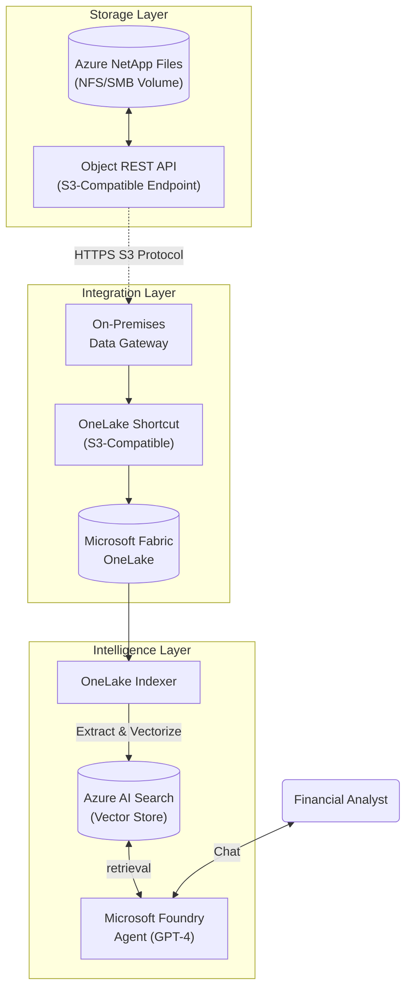

# Azure NetApp Files to Microsoft Foundry: Zero-Copy RAG Workshop

## Overview & Architecture

This lab demonstrates how **Microsoft Foundry** can ground AI agents on **enterprise file data stored in Azure NetApp Files** using **Microsoft Fabric OneLake shortcuts**, enabling a zero-copy AI data path without ETL, data duplication, or re-platforming.

The solution architecture uses:

* **Azure NetApp Files** as the authoritative system of record for unstructured file data
* **Object REST API** (S3-compatible access) to expose file data for analytics and AI consumption
* **Microsoft Fabric OneLake shortcuts** to virtualize Azure NetApp Files data
* **Azure AI Search** to index virtualized data
* **Microsoft Foundry** to build and run agents grounded on that data

This lab is intended for education, enablement, and design validation. It illustrates a supported architectural pattern, but it is not a production-hardened reference architecture.

### What this lab demonstrates

* How enterprise file data can remain in place on Azure NetApp Files while being consumed by analytics and AI services
* How OneLake shortcuts enable virtualized access to file data without copying it
* How Microsoft Foundry agents can be grounded on enterprise data through Azure AI Search
* How Azure NetApp Files participates as a first-class data foundation for AI workloads on Azure

### The "Zero-Copy" Data Flow

1. **Storage**: Financial docs in ANF (NFS/SMB) are exposed via **Object REST API** (S3-compatible).
2. **Integration**: **Microsoft Fabric OneLake** shortcuts virtualize this data.
3. **Indexing**: **Azure AI Search** indexes the virtualized data directly from OneLake.
4. **Consumption**: **Microsoft Foundry** agents use the index to answer questions.


```mermaid
graph TD
    subgraph Storage [Storage Layer]
        ANF[("Azure NetApp Files\n(NFS/SMB Volume)")]
        ObjAPI["Object REST API\n(S3-Compatible Endpoint)"]
        ANF <--> ObjAPI
    end

    subgraph Integration [Integration Layer]
        Gateway["On-Premises\nData Gateway"]
        OneLake[("Microsoft Fabric\nOneLake")]
        Shortcut["OneLake Shortcut\n(S3-Compatible)"]

        ObjAPI -.->|HTTPS S3 Protocol| Gateway
        Gateway --> Shortcut
        Shortcut --> OneLake
    end

    subgraph Intelligence [Intelligence Layer]
        Indexer["OneLake Indexer"]
        AISearch[("Azure AI Search\n(Vector Store)")]
        Agent["Microsoft Foundry\nAgent (GPT-4)"]

        OneLake --> Indexer
        Indexer -->|Extract & Vectorize| AISearch
        AISearch <-->|retrieval| Agent
    end

    User("Financial Analyst") <-->|Chat| Agent
```

---

## Prerequisites & Environment Setup

This lab is designed to be approachable for customers and partners with general familiarity with Azure. The lab emphasizes solution flow and architectural intent, while calling out external documentation where deeper service-level setup or advanced configuration may be required.

**Goal**: Prepare your Azure subscription and user account with all necessary providers and permissions.

### Key Licensing Requirements

⚠️ **IMPORTANT**: Before starting, ensure you have the following:

1. **Microsoft Fabric Capacity** — This lab requires a **Fabric Trial** (60-day free trial) or **Paid Fabric Capacity** (F2 SKU or higher). The **free Fabric tier is NOT sufficient** — it does not support the On-Premises Data Gateway required for connecting to ANF's Object REST API.
   * To start a Fabric trial: Go to [app.fabric.microsoft.com](https://app.fabric.microsoft.com), click your profile icon (top-right) → **Start trial** → Accept the Fabric capacity trial.
   * **Note**: Guest users in a tenant **cannot** start Fabric trials. If you are a guest user, ask your tenant administrator to provision Fabric capacity (F2 SKU) for the lab.

2. **Azure Subscription Permissions** — You need either:
   * **Owner** role on the subscription, OR
   * **Contributor** + **User Access Administrator** roles
   * If you lack User Access Administrator, ask an admin to pre-assign the **Cognitive Services OpenAI User** role before Step 5.2, or ensure your subscription Owner pre-assigns this role.

3. **Single Region Deployment** — Deploy all resources in the **same Azure region** (recommended: **East US 2**) to minimize latency and avoid cross-region data transfer costs.

---

## 1. Validate Azure Subscription Requirements

**Goal**: Ensure your Azure subscription is ready to run the lab without permission or provider issues.

### 1.1 Login to Azure Portal

1. Open a browser and go to **<https://portal.azure.com>**
2. Sign in with your Azure work account.
3. If you belong to multiple Azure AD tenants, ensure you are signed in to the **correct tenant** (the one that owns your Azure subscription).

### 1.2 Verify Your Subscription Role

1. In the Azure portal, search for **Subscriptions**.
2. In the **Subscriptions** blade, select the subscription you will use for the lab.
3. In the left-hand menu, select **Access control (IAM)**.
4. Click **View my access** to see your assigned roles.
5. Confirm your user has **Owner** or **Contributor + User Access Administrator**.
   * If you only have **Contributor**, note that Step 5.2 will require an admin to assign the **Cognitive Services OpenAI User** role (or you can work with an admin to pre-assign this role now).
   * If your roles are inherited from a group (shown as "Specified access"), expand the role entry to see the group name.

### 1.3 Register Required Resource Providers

1. In the left menu, scroll down and select **Resource providers** (not under Settings — it is a separate menu item).
2. Confirm the following providers are **Registered**:
   * **Microsoft.NetApp** — Required for Azure NetApp Files
   * **Microsoft.Search** — Required for Azure AI Search
   * **Microsoft.CognitiveServices** — Required for Azure AI services and OpenAI
   * **Microsoft.MachineLearningServices** — Required for Microsoft Foundry
   * **Microsoft.Fabric** — Required for OneLake and Microsoft Fabric
3. If any show **Not registered**, select the provider and click **Register**. Registration may take 5–10 minutes.

### 1.4 Register Preview Features for ANF Object REST API

The Object REST API for Azure NetApp Files requires preview feature flags to be enabled on your subscription.

1. In the Azure portal, search for **Preview features**.
2. In the search bar, type **ANFEnableObjectRESTAPI**.
3. Select the feature and click **Register** if not already registered.
4. Repeat for **ANFEnableS3ReadOnly**.

⚠️ If you encounter a message like "Preview features not available in this region," contact Azure Support to request whitelist approval for ANF Object REST API features in your region.

---

## 2. Create an Azure Resource Group

**Goal**: Organize all lab resources in a single resource group.

1. In the Azure portal, search for **Resource groups**.
2. Click **+ Create**.
3. Fill in:
   * **Subscription**: Select your subscription
   * **Resource group name**: `HOL-Workshop-RG`
   * **Region**: `East US 2` (or your chosen region — use the same region for all resources)
4. Click **Review + create**, then **Create**.

✅ **Verification**: After creation, the Resource group blade should show `HOL-Workshop-RG` in your subscription with status "Succeeded".

---

## 3. Configure Azure NetApp Files

**Goal**: Create an Azure NetApp Files volume and enable S3-compatible (Object REST API) access.

### 3.1 Create a Virtual Network (Optional: Auto-Creation During Volume Creation)

If you prefer to manually create a VNet first, follow these steps. Otherwise, you can skip to 3.2 — the Azure portal will auto-create a VNet and delegated subnet during volume creation.

**To manually create a VNet:**

1. In the Azure portal, search for **Virtual networks**.
2. Click **+ Create**.
3. Fill in:
   * **Resource group**: `HOL-Workshop-RG`
   * **Name**: `Workshop-VNet`
   * **Region**: `East US 2`
   * **IPv4 address space**: `10.0.0.0/16`
4. Click **Next: Security**, then **Next: IP Addresses**.
5. In the Subnets section, add two subnets:
   * **Subnet 1** (default VM subnet):
     * **Name**: `default`
     * **Subnet address range**: `10.0.0.0/24`
   * **Subnet 2** (ANF-delegated subnet):
     * **Name**: `anf-subnet`
     * **Subnet address range**: `10.0.1.0/24`
     * **Subnet delegation**: Expand "Delegate subnet to a service" and select `Microsoft.NetApp/volumes`
6. Click **Review + create**, then **Create**.

✅ **Verification**: The VNet should show two subnets with the delegated subnet showing "Microsoft.NetApp/volumes" in the Delegations column.

### 3.2 Create a NetApp Account

1. In the Azure portal, search for **Azure NetApp Files**.
2. In the Azure NetApp Files blade, click **+ Create**.
3. Fill in the form:
   * **Name**: `Workshop-NetApp-Account`
   * **Resource group**: `HOL-Workshop-RG`
   * **Region**: `East US 2`
   * **Account Type**: `NetApp account` (default)
4. Click **Create**.

✅ **Verification**: After creation, the NetApp account should appear in the Azure NetApp Files list with status "Succeeded".

### 3.3 Create a Capacity Pool

1. Open the NetApp account you just created.
2. In the left menu, select **Capacity pools**, then click **+ Add pool**.
3. Fill in:
   * **Name**: `Workshop-Pool`
   * **Service level**: Select **Flexible** (allows 1 TiB minimum and is more cost-effective) OR **Standard** (requires 2 TiB minimum)
   * **Size**:
     * If **Flexible**: `1 TiB` (minimum)
     * If **Standard**: `2 TiB` (minimum)
   * **QoS Type** (only for Flexible): `Manual` (allows explicit throughput setting)
4. If using Flexible tier, you may see optional settings:
   * **Cool Access** (checkbox): Optional — leave unchecked for this lab
5. Click **Create**.

⏳ **Wait for completion**: The pool creation may take 5–10 minutes. The status should change to "Succeeded" before proceeding.

✅ **Verification**: After creation, the Capacity pools section should list `Workshop-Pool` with status "Succeeded" and the correct size.

### 3.4 Create a Volume

1. In the NetApp account left menu, select **Volumes**, then click **+ Add volume**.
2. Fill in the form:
   * **Name**: `anf-finance-vol`
   * **Capacity pool**: Select `Workshop-Pool`
   * **Quota (GiB)**: Change from default 50 GiB to **100 GiB**
   * **Virtual network**:
     * If you created a VNet manually in 3.1, select `Workshop-VNet`
     * If you skipped 3.1, select **(new)** to auto-create — the portal will create a new VNet and delegated subnet automatically
   * **Delegated subnet**:
     * If using existing VNet: Select `anf-subnet`
     * If auto-creating: The portal will create this automatically (typically named `default`)
   * **Protocol**: `NFS` (NFSv3 recommended)
3. If using Flexible capacity pool, you will see:
   * **Max. Throughput (MiB/s)**: Set to **128** (or match your pool baseline)
   * **Cool Access settings**: Leave at defaults
4. Click **Review + Create**, then **Create**.

✅ **Verification**: The volume should appear in the Volumes list with status "Succeeded" and should show a Mount path like `10.0.2.4:/anf-finance-vol`.

### 3.5 Generate a Self-Signed Certificate for S3 Access

The Object REST API (S3 bucket) requires an X.509 certificate for TLS. Generate a self-signed certificate on your local machine or the Gateway VM.

**On Windows or Linux with OpenSSL installed:**

```bash
openssl req -x509 -newkey rsa:4096 -keyout private.key -out cert.pem -days 365 -nodes -subj "/CN=anf-workshop"
```

This creates two files:

* `cert.pem` — The certificate (text file)
* `private.key` — The private key (text file)

**Important**: The FQDN you enter in the bucket configuration must match the certificate's CN (Common Name). In this example, the CN is `anf-workshop`.

### 3.6 Create a Bucket for S3-Compatible Object Access

⚠️ **CRITICAL WARNING**: If bucket creation fails, Azure may automatically delete the volume AND capacity pool as part of deployment rollback. **Ensure the volume is fully in 'Succeeded' state (wait at least 5 minutes after volume creation, verified in Step 3.4) before proceeding.**

1. Open the volume you created (`anf-finance-vol`).
2. In the left menu, select **Storage service** → **Buckets**.
3. Click **+ Create or update bucket**.
4. Fill in the initial fields:
   * **Name**: `finance-data`
   * **Path**: `/` (root path)
   * **User ID (UID)**: `1000` (standard unprivileged user; NOT root/0)
   * **Group ID (GID)**: `1000` (standard unprivileged user; NOT root/0)
   * **Permissions**: Check both **Read** and **Write**
5. Click **Save**. The portal will expand to show a **Certificate management** section (this is normal and expected).
6. In the Certificate section:
   * **Fully Qualified Domain Name (FQDN)**: `anf-workshop` (must match the CN in your certificate exactly)
   * **Certificate (PEM file)**: Click the browse button and select your `cert.pem` file from Step 3.5.
   * **Upload**: Click to upload the file.
7. Click **Save** again.

⚠️ **If you see an error**: "Could not extract Private Key from PEM file. Key must be in PKCS#1 or PKCS#8 format."

* This means your PEM file contains only the certificate, not the private key
* Regenerate using: `cat cert.pem private.key > combined.pem`
* Then upload `combined.pem` to the Certificate field

✅ **Verification**: After creation, the Buckets section should list `finance-data` with status "Active".

### 3.7 Generate S3 Access Credentials

1. Open the bucket (`finance-data`).
2. Look for a **"Generate access key"** button or link.
3. Click it and fill in:
   * **Access key lifespan (days)**: `365`
4. Click **Generate keys**.
5. **IMPORTANT**: Copy and save both keys immediately to a secure location — they cannot be retrieved later:
   * **Access key** (e.g., `5P0YB616211HBAJ36HJ8`)
   * **Secret access key** (shown once after generation)
   * **Endpoint URL** / **Mount path** (e.g., `https://anf-workshop/finance-data`)

✅ **Verification**: The bucket details should show "Access keys: 1" indicating at least one active key.

---

## 4. Prepare Lab Data and Upload to ANF

**Goal**: Make sample financial data available in the ANF volume so it can be indexed and used by the RAG agent.

### 4.1 Download Lab Data

1. Download the `test_data` folder from this repository to your local machine.
2. Extract the contents — you should see folders like `invoices/` and `financial_statements/`.

### 4.2 Upload Data via NFS Mount (Recommended Primary Method)

The most natural way to populate an ANF volume is to mount it via NFS and copy files. This method works from any machine with network access to the ANF volume.

**From a VM in the same VNet or on-premises (with VPN/ExpressRoute):**

```bash
# Create mount point
sudo mkdir -p /mnt/anf

# Mount the volume
sudo mount -t nfs -o rw,hard,rsize=65536,wsize=65536 10.0.2.4:/anf-finance-vol /mnt/anf

# Verify mount
mount | grep anf

# Copy lab data
cp -r test_data/invoices/ /mnt/anf/
cp -r test_data/financial_statements/ /mnt/anf/

# Verify files appear
ls -la /mnt/anf/
```

⚠️ **Important**: The IP address `10.0.2.4` in the mount command is an example. Use the actual Mount path from your volume's Overview blade (e.g., `10.0.2.4:/anf-finance-vol`).

✅ **Verification**: Files should appear in the ANF volume and be automatically visible as S3 objects via the Object REST API (no additional copy needed).

### 4.3 Upload Data via S3 (Optional Alternative)

If you prefer to test the S3/Object REST API path, you can use the AWS CLI from a VM in the same VNet as ANF.

**On the Gateway VM (created in Section 5):**

```bash
# Install AWS CLI v2 (if not already installed)
# https://docs.aws.amazon.com/cli/latest/userguide/getting-started-install.html

# Configure credentials
aws configure
# Enter:
#   AWS Access Key ID: [from Step 3.7]
#   AWS Secret Access Key: [from Step 3.7]
#   Default region: us-east-1
#   Default output format: json

# Add hosts file entry (Windows or Linux)
# Windows: C:\Windows\System32\drivers\etc\hosts
# Linux: /etc/hosts
# Add: 10.0.2.4 anf-workshop

# Upload data
aws s3 cp ./invoices/ s3://finance-data/invoices/ --recursive --endpoint-url https://anf-workshop --no-verify-ssl

aws s3 cp ./financial_statements/ s3://finance-data/financial_statements/ --recursive --endpoint-url https://anf-workshop --no-verify-ssl
```

⚠️ **Known issue**: The `aws s3 cp` command may fail with a SHA-256 checksum error. Use the NFS/SMB method or individual `aws s3api put-object` commands as a workaround.

---

## 5. Create a Gateway VM and Install On-Premises Data Gateway

**Goal**: Set up a Windows VM in the same VNet as ANF to host the On-Premises Data Gateway, which enables Fabric to connect to ANF's private S3 endpoint.

### 5.1 Create a Windows VM

1. In the Azure portal, search for **Virtual machines**.
2. Click **+ Create** → **Azure virtual machine**.
3. Fill in:
   * **Resource group**: `HOL-Workshop-RG`
   * **Virtual machine name**: `ANF-Gateway-VM`
   * **Region**: `East US 2`
   * **Image**: `Windows Server 2022 Datacenter` or later (e.g., 2025 Datacenter)
   * **Size**: `Standard_D2s_v3` (recommended for gateway)
   * **Username**: `workshopadmin`
   * **Password**: Set a strong password (you'll need this for RDP access)
4. Click **Next: Disks** → **Next: Networking**.
5. In the Networking tab:
   * **Virtual network**: Select the VNet you created in Section 3 (`Workshop-VNet` or the auto-created VNet)
   * **Subnet**: The portal will suggest a new subnet (e.g., `default` or a new one) — accept this (the delegated ANF subnet cannot host VMs)
   * **Public IP**: If your subscription has a "Do Not Allow Public IPs" policy, set to **None**. You'll connect via **Azure Bastion** instead.
   * Otherwise, set to **Create new** for direct RDP access
6. Click **Review + create**, then **Create**.

⏳ **Wait for completion**: The VM creation may take 5–10 minutes.

✅ **Verification**: The VM should appear in your Virtual machines list with status "Succeeded".

### 5.2 Create Azure Bastion (If VM has No Public IP)

If your subscription enforces a no-public-IP policy, use Azure Bastion for RDP access.

1. In the Azure portal, search for **Bastions**.
2. Click **+ Create**.
3. Fill in:
   * **Name**: `Workshop-Bastion`
   * **Resource group**: `HOL-Workshop-RG`
   * **Virtual network**: Select your Workshop VNet
   * **Public IP name**: `bastion-ip`
   * **Tier**: `Developer` (single-session, free tier)
4. Click **Create** (may take 5–10 minutes).

✅ **Verification**: After creation, go to your VM's Overview page. You should see a "Connect" button with a "Bastion" option.

### 5.3 Connect to the Gateway VM via RDP

**Option A: Direct RDP (if VM has public IP)**

1. In the Azure portal, open the VM's Overview page.
2. Click **Connect** → **RDP** → **Download RDP file**.
3. Open the RDP file on your local machine and sign in with `workshopadmin` and your password.

**Option B: Azure Bastion (if VM has no public IP)**

1. In the Azure portal, open the VM's Overview page.
2. Click **Connect** → **Bastion**.
3. Sign in with `workshopadmin` and your password.
4. ⚠️ **Note**: Bastion Developer tier supports only **one active session at a time**. Complete all VM tasks in a single session.

### 5.4 Install the On-Premises Data Gateway

1. Inside the VM, open a web browser and go to `https://aka.ms/gateway-installer`.
2. Download the **On-premises data gateway (recommended)** installer — NOT personal mode.
3. Run the installer and follow the prompts.
4. After installation completes, the gateway configurator window will open. Click **Sign in**.
5. Sign in with the **same Azure work account** used for Microsoft Fabric.
   * If you belong to multiple tenants, select the **correct tenant** (the one that owns your Fabric workspace).
6. After sign-in, the configurator will suggest a gateway name. Change it to `ANF-Gateway`.
7. Click **Register**.
8. Verify the configurator shows: `ANF-Gateway is online and ready to be used` with `Microsoft Fabric: Default environment - Ready`.

✅ **Verification**: The gateway name `ANF-Gateway` should appear as **Online** in the configurator, with Fabric showing as "Ready".

---

## 6. Create a Microsoft Fabric Workspace and Lakehouse

**Goal**: Set up a Fabric workspace to host the OneLake Lakehouse, which will virtualize ANF data via S3-compatible shortcuts.

### 6.1 Switch to Correct Tenant (Multi-Tenant Users)

1. Go to [app.fabric.microsoft.com](https://app.fabric.microsoft.com).
2. If you belong to multiple Azure AD tenants, click your profile icon (top-right) → **Switch tenant**.
3. Select the **correct tenant** (the one that owns your Azure subscription).

### 6.2 Create a Fabric Workspace with Capacity License

1. Click **Workspaces** in the left sidebar.
2. Click **+ New workspace**.
3. Fill in:
   * **Name**: `Financial_RAG_Workshop`
   * **License mode**: Select **Trial** (for free 60-day Fabric capacity trial) OR **Fabric capacity** (if you have a paid F SKU assigned)
4. Click **Create**.

⏳ **Wait for creation**: The workspace may take 1–2 minutes to initialize.

⚠️ **If you see a licensing error**: "Cannot create workspace without Fabric capacity." This means either:

* You haven't started a Fabric trial yet (Profile → Start trial)
* Your trial has expired
* The free Fabric tier is active (not sufficient for this lab)

✅ **Verification**: The workspace should appear in your Workspaces list and you should be able to open it.

### 6.3 Verify You Are in the Fabric Experience

1. In the workspace, check the bottom-left of the portal.
2. You should see **"Microsoft Fabric"** (not "Power BI").
3. If it shows "Power BI", click it and switch to "Data Engineering" or "Microsoft Fabric".

### 6.4 Create a Lakehouse

1. In the workspace, click **+ New item**.
2. Select **Lakehouse**.
3. Enter the name: `FinDataLake`
4. Click **Create**.

⏳ **Wait for creation**: The Lakehouse may take 1–2 minutes to initialize.

✅ **Verification**: The Lakehouse should appear in the workspace with a folder icon showing "Files" and "Tables" sections.

---

## 7. Create an S3-Compatible Connection and OneLake Shortcut to ANF

**Goal**: Link the ANF S3 endpoint to the Lakehouse via an OneLake shortcut, making ANF data visible to AI Search and agents.

### 7.1 Create S3-Compatible Connection

1. Open the Lakehouse (`FinDataLake`).
2. Right-click on the **Files** section (in the main panel).
3. Select **New shortcut**.
4. In the shortcut creation wizard, select **Amazon S3 Compatible** as the source type.
5. Click **New connection** (if no existing connection exists).
6. Fill in the connection details:
   * **Data gateway**: Select `ANF-Gateway` (the gateway you registered in Step 5.4)
   * **URL**: `https://anf-workshop` (the FQDN that matches your bucket's certificate CN, not the raw IP)
   * **Connection name**: `ANF-S3-Connection`
   * **Authentication type**: `Access key` (if not already selected)
   * **Access key**: [from Step 3.7]
   * **Secret access key**: [from Step 3.7]
7. Click **Create connection**.

⚠️ **If the Data gateway dropdown shows "(none)"**: This indicates you are on the **free Fabric tier**, which does NOT support On-Premises Data Gateway. You must activate a Fabric Trial or Paid Capacity. Go back to Step 6.2 and ensure the workspace is created with "Trial" license mode.

✅ **Verification**: After creation, the connection should show "Connected" status.

### 7.2 Create the OneLake Shortcut

1. Continue in the shortcut wizard (or right-click Files → New shortcut again if the dialog closed).
2. Select **Amazon S3 Compatible** and choose the connection you just created.
3. Fill in:
   * **Bucket**: `finance-data`
   * **Directory**: `/` (root)
   * **Shortcut name**: `anf_shortcut`
4. Click **Create**.

⏳ **Wait for creation**: The shortcut may take 1–2 minutes to be created and mounted.

✅ **Verification**: After creation, expand the Files section in the Lakehouse. You should see a folder `anf_shortcut` containing subfolders like `invoices/` and `financial_statements/` (if data was uploaded via NFS in Step 4.2). If the shortcut appears empty, verify the On-Premises Data Gateway is online and connected.

---

## 8. Create an Azure AI Search Service

**Goal**: Set up Azure AI Search to index and vectorize the ANF data for RAG retrieval.

### 8.1 Create Azure AI Search Resource

1. In the Azure portal, search for **Azure AI Search**.
2. Click **+ Create**.
3. Fill in:
   * **Resource group**: `HOL-Workshop-RG`
   * **Service name**: `Workshop-AI-Search`
   * **Region**: `East US 2`
   * **Pricing tier**: `Basic` (includes free semantic search) or `Standard` (for higher scale)
4. Click **Review + create**, then **Create**.

⏳ **Wait for creation**: The service may take 5–10 minutes.

✅ **Verification**: The service should appear in your list of AI Search resources.

### 8.2 Enable System-Assigned Managed Identity

1. Open the AI Search resource you just created.
2. In the left menu, select **Identity**.
3. Under "System assigned", toggle the switch to **On**.
4. Click **Save**.
5. A managed identity will be generated — note the **Object ID** (you'll need this in Step 8.3).

✅ **Verification**: The System assigned tab should show "Status: Enabled" with an Object ID displayed.

### 8.3 Grant the AI Search Service Access to Your Fabric Workspace

The AI Search service's managed identity must have permission to read from your Fabric Lakehouse.

⚠️ **IMPORTANT**: The Fabric UI "Add people" panel does NOT support service principals/managed identities. Use one of the following workarounds:

**Workaround A: Use Fabric REST API (Recommended)**

1. Get your Fabric workspace ID: Open your Fabric workspace in the browser; the URL contains `/groups/{workspaceId}/...` — copy the workspace GUID.
2. Get the AI Search managed identity Object ID from Step 8.2.
3. Use a REST client (e.g., Postman, VS Code REST Client, or PowerShell) to make this request:

```
POST https://api.fabric.microsoft.com/v1/workspaces/{workspaceId}/roleAssignments
Authorization: Bearer [your Azure AD token]
Content-Type: application/json

{
  "principal": {
    "id": "{ManagedIdentityObjectId}",
    "type": "ServicePrincipal"
  },
  "role": "Contributor"
}
```

If successful, you'll get a 201 Created response.

1. Go back to your Fabric workspace → **Manage access** → verify the service principal now appears with "Contributor" role.

**Workaround B: Use Fabric Admin Portal**

1. Go to [Fabric Admin Portal](https://app.fabric.microsoft.com/admin-portal).
2. Navigate to **Capacity admin** → **Capacity settings** → your capacity.
3. Add the managed identity (by Object ID) to the capacity's admin roles.

**Workaround C: Ask Tenant Admin**

Ask your Fabric tenant administrator to assign the managed identity to the workspace via PowerShell or the Admin Portal.

✅ **Verification**: Open your Fabric workspace → **Manage access** → verify the AI Search service principal appears with "Contributor" role.

---

## 9. Index OneLake Data Using Azure AI Search

**Goal**: Import, vectorize, and index the ANF data so it can be retrieved by the agent.

### 9.1 Start the "Import Data" Wizard

1. Open your Azure AI Search service in the Azure portal.
2. In the toolbar, click **Import data (new)** (note: the old "Import data" button still exists separately).

### 9.2 Select Target Scenario

1. The wizard will ask: **"What scenario are you targeting?"**
2. Select **RAG** (Retrieval Augmented Generation).
3. Click **Next**.

### 9.3 Configure OneLake Data Source

1. Select **Microsoft OneLake** as the data source type.
2. Click **Next**.
3. In the "Configure Microsoft OneLake" section, fill in:
   * **Connect by**: Select **Lakehouse URL** (not a workspace/lakehouse picker dropdown)
   * **Lakehouse URL**: Open your Lakehouse in Fabric and copy the URL from the browser address bar. It should look like: `https://msit.powerbi.fabric.microsoft.com/groups/{workspaceId}/lakehouses/{lakehouseId}`
   * **Lakehouse folder/shortcut**: Enter `anf_shortcut` (the shortcut you created in Step 7.2)
   * If the shortcut appears empty or you uploaded data directly to the Lakehouse Files/ path, leave this field **blank**
4. Click **Next**.

### 9.4 Configure Vectorization

1. In the "Vectorize your text" section:
   * **Kind**: Select **Microsoft Foundry** (NOT "Azure OpenAI" — see Lesson 49)
   * **Select your Foundry project**: Select your Foundry project (you'll create this in Section 10)
   * **Select your model**: Select **text-embedding-3-small**
2. Click **Next**.

⚠️ **If you haven't created the Foundry project yet**: You can complete this step later. For now, create a basic index without vectorization and add vectorization afterward.

### 9.5 Configure Index Fields

1. In the "Customize target index" section:
   * **Content**: Mark as **Searchable**
   * **Metadata_storage_path**: Check **Retrievable** (required for document citations in the agent)
   * Review other fields as needed
2. Click **Next**.

### 9.6 Review and Create the Indexer

1. Review the configuration summary.
2. Click **Create** to start the indexer run.

⏳ **Wait for indexing to complete**: This may take 5–10 minutes depending on the number and size of documents.

✅ **Verification**: After completion, check the indexer status:

* Open Azure AI Search → **Indexers** → select your indexer
* Status should show **Success**
* **Documents succeeded** should be greater than 0 (e.g., 29/29)
* **Index document count** should be greater than 0 (e.g., 51 after chunking)

---

## 10. Create a Microsoft Foundry Hub and Project

**Goal**: Set up the Foundry environment where you'll deploy LLM models and create the RAG agent.

### 10.1 Create Azure AI Services Resource

1. In the Azure portal, search for **Azure AI services**.
2. Click **+ Create**.
3. Fill in:
   * **Resource group**: `HOL-Workshop-RG`
   * **Region**: `East US 2` (or a region where GPT-4o is available; alternatives: Sweden Central, West US 3)
   * **Name**: `Workshop-AI-Services`
   * **Pricing tier**: `Standard S0`
4. Click **Review + create**, then **Create**.

✅ **Verification**: The resource should appear in your list with type "Azure AI services".

### 10.2 Deploy Language Models

1. Open the AI Services resource you just created.
2. In the left menu, click **Model deployments** (or **Manage Deployments** — this opens the Microsoft Foundry Studio).
3. You'll be redirected to Microsoft Foundry (ai.azure.com). Click **Create new deployment** (or **+ Deploy model**).
4. Deploy **gpt-4o**:
   * **Model name**: `gpt-4o`
   * **Model version**: Select the latest version (e.g., 2024-11-20)
   * **Deployment name**: `gpt-4o`
   * **Deployment type**: `Global Standard`
   * **Tokens Per Minute (TPM)**: `250000` (adjust based on quota)
   * Click **Deploy**
5. Deploy **text-embedding-3-small** (required for AI Search vectorization):
   * **Model name**: `text-embedding-3-small`
   * **Deployment name**: `text-embedding-3-small`
   * **Deployment type**: `Global Standard`
   * Click **Deploy**

⏳ **Wait for deployments to complete**: This may take 5–10 minutes.

✅ **Verification**: Both models should appear in the Deployments list with status "Succeeded".

### 10.3 Assign Yourself the "Cognitive Services OpenAI User" Role (If Needed)

This step allows you to call the deployed models from agents.

1. Go back to the Azure portal and open the AI Services resource.
2. In the left menu, click **Access control (IAM)**.
3. Click **+ Add role assignment**.
4. Search for **Cognitive Services OpenAI User** and select it.
5. Click **Next**.
6. Under **Members**, select **User, group, or service principal** and search for your user account.
   * If the search doesn't return results, this may be a tenant configuration issue. Skip this step — you may already have sufficient permissions through your subscription-level Owner role.
7. Click **Review + assign**.

✅ **Verification**: The role should appear in the IAM blade next to your user account.

### 10.4 Create a Foundry Hub

1. Go to [ai.azure.com](https://ai.azure.com).
2. Click **+ Create project** (or if no project exists, you'll be prompted to create a hub first).
3. For **Hub Creation**, fill in:
   * **Hub name**: `Finance-Hub`
   * **Resource group**: `HOL-Workshop-RG`
   * **AI services resource**: Select `Workshop-AI-Services` (created in 10.1)
4. Click **Create hub**.

⏳ **Wait for hub creation**: This may take 2–5 minutes.

### 10.5 Create a Foundry Project

1. After the hub is created, you'll be prompted to create a project. Fill in:
   * **Project name**: `Finance-RAG-Project`
   * **Hub**: Select `Finance-Hub` (you just created)
2. Click **Create project**.

⏳ **Wait for project creation**: This may take 2–5 minutes.

✅ **Verification**: You should be redirected to the project dashboard. The project name `Finance-RAG-Project` should appear at the top.

### 10.6 Connect Resources to the Project

1. In the project, click **Settings** (gear icon, top-right).
2. Under **Connected resources**, ensure the following are connected:
   * **Azure OpenAI**: `Workshop-AI-Services` (created in 10.1)
   * **Azure AI Search**: `Workshop-AI-Search` (created in Section 8)
   * If not connected, click **Add resource** and select them.
3. Click **Save**.

✅ **Verification**: Both resources should show "Connected" status in Settings.

---

## 11. Run and Validate a Grounded Agent

**Goal**: Create an agent that uses the indexed ANF data to answer questions about financial documents.

### 11.1 Create an Agent

1. In your Foundry project, click **Agents** in the left sidebar.
2. Click **+ New agent**.
3. On the **Setup** panel (right side), fill in:
   * **Agent name**: `Finance-RAG-Agent`
   * **Agent ID**: `finance-rag-agent` (auto-filled, lowercase)
   * **Instructions**: Copy and paste:

     ```
     You are a Financial Analyst Assistant. Use the attached financial documents to answer questions.
     Always search your knowledge base before responding.
     Cite the specific document and page when providing information.
     If asked about data not in your knowledge base, say "I don't have that information in my available documents."
     ```

   * **Deployment**: Select `gpt-4o` (from Section 10.2)

### 11.2 Add Knowledge (AI Search Index)

1. In the **Setup** panel, find the **Knowledge** section.
2. Click **+ Add** next to Knowledge.
3. In the "Add knowledge" dialog, select **Azure AI Search**.
4. Fill in:
   * **Azure AI Search resource connection**: If no connection exists, click **Connect other Azure AI Search resource**, select your `Workshop-AI-Search` service, and click **Add connection**.
   * **Azure AI Search index**: Select the index you created in Section 9 (e.g., `rag-1234567`).
   * **Display name**: Enter `anf-finance-index` (⚠️ **must be all lowercase** — no uppercase letters allowed).
   * **Search type**: Should auto-populate as **Hybrid (vector + keyword)** if your index is vectorized.
   * **Retrieved documents**: Leave at default (5) or adjust to 3–20 as needed.
5. Click **Add**.

✅ **Verification**: The Knowledge section should now show `anf-finance-index` as an added knowledge source.

### 11.3 Test the Agent

1. In the agent view, click **Chat** or **Test** (bottom of the Setup panel).
2. Try a broad query first to establish context:

   ```
   What financial documents do you have access to? List all the documents you can see.
   ```

3. The agent should respond with a list of documents it found in the index.
4. Then try a specific query:

   ```
   What is the total spend for vendor 'OfficeMax'?
   ```

5. Check the **Run info** panel to see:
   * **Tools used**: Should show Azure AI Search tool was called
   * **Documents retrieved**: Should list source documents with citations
   * **Response time**: Typically 5–30 seconds depending on query complexity

⚠️ **If the agent says "I don't have that information"**: This may mean:

* The knowledge base is empty (check indexer status in Section 9)
* The agent isn't triggering the knowledge tool (try a broader query like "Search the documents and tell me what you find")
* The data wasn't indexed correctly (verify document count in AI Search)

✅ **Verification**: Successful RAG flow shows:

* Tool invocation (Azure AI Search)
* Retrieved document count > 0
* Agent response with citations to source documents
* Complete zero-copy data flow from ANF → Lakehouse → AI Search → Agent

---

## Troubleshooting

### Gateway Issues

**Problem**: Azure Bastion Developer tier only allows one session at a time.

* **Solution**: Complete all VM tasks (data upload, OPDG installation) in a single Bastion session. Don't open a second Bastion connection in a different browser tab.

**Problem**: Gateway VM cannot reach ANF S3 endpoint.

* **Solution**: Ensure the VM is in the same VNet as ANF. Verify the hosts file entry: `10.0.2.4 anf-workshop` (use your actual ANF IP and FQDN).

**Problem**: "Data gateway dropdown empty" or "Manage connections and gateways not available."

* **Solution**: This indicates the Fabric workspace is on the **free tier**. Upgrade to Fabric Trial or Paid Capacity.

### OneLake Shortcut Issues

**Problem**: Shortcut appears empty or shows "Access denied."

* **Solution**:
  1. Verify the On-Premises Data Gateway is **Online** (check the gateway configurator on the VM).
  2. Verify the AI Search service managed identity has **Contributor** role on the Fabric workspace (Step 8.3).
  3. Check the connection credentials (Access Key, Secret Key) are correct.

**Problem**: Shortcut creation fails with "Cannot connect to gateway."

* **Solution**:
  1. Ensure the gateway VM is running and the gateway is signed in and registered.
  2. Restart the gateway: On the VM, right-click the gateway configurator in the system tray → Restart.
  3. Verify the correct tenant is selected during gateway sign-in.

### AI Search Indexing Issues

**Problem**: Indexer fails with "Cannot access Lakehouse" or "Access Denied."

* **Solution**: Verify the AI Search managed identity has **Contributor** role on the Fabric workspace (Step 8.3 using the REST API workaround).

**Problem**: Indexer succeeds but document count is 0.

* **Solution**:
  1. Verify data was uploaded to ANF (check via NFS mount).
  2. Verify the Lakehouse shortcut is not empty (expand `anf_shortcut` in Lakehouse Files).
  3. Re-run the indexer: Open AI Search → Indexers → select indexer → **Run**.

**Problem**: Index created but vectorization failed.

* **Solution**:
  1. Verify the `text-embedding-3-small` model is deployed (check Section 10.2).
  2. Verify you selected **Microsoft Foundry** (not "Azure OpenAI") as the vectorization Kind in Step 9.4.
  3. Re-run the indexer.

### Agent Issues

**Problem**: Agent says "I don't know" even though documents are indexed.

* **Solution**:
  1. Verify the knowledge source is added (Check **Setup** → **Knowledge** section).
  2. Try a **broader query first** to establish context (e.g., "What documents do you have?").
  3. In the agent's **Setup** panel, look for **Model settings** (Temperature, Top P) — try lowering Temperature to 0.3 for more deterministic responses.
  4. Check the **Run info** panel — verify the Azure AI Search tool was actually invoked. If not, the agent may not be recognizing that a knowledge lookup is needed.

**Problem**: Agent queries take longer than 30 seconds.

* **Solution**:
  1. Check if the AI Search index has a large number of documents (1000+) — this can slow vectorized retrieval.
  2. Try reducing the **Retrieved documents** slider in the Knowledge settings (Step 11.2) from 20 to 5 or 10.
  3. Monitor the Azure AI Search quota — if you're close to the limit, queries may be throttled.

**Problem**: "Display name must be lowercase" error when adding knowledge.

* **Solution**: Enter the display name in all lowercase (e.g., `anf-finance-index` not `ANF-Finance-Index`).

**Problem**: Agent cannot see the knowledge source in the Knowledge connection dropdown.

* **Solution**:
  1. Verify the Azure AI Search resource is connected to the Foundry project (Section 10.6, **Settings** → **Connected resources**).
  2. Try adding the knowledge source via "Connect other Azure AI Search resource" (see Lesson 61).

### Data Flow Validation

To verify the complete zero-copy data pipeline:

1. **ANF Volume**: Check data exists via NFS mount (`mount 10.0.2.4:/anf-finance-vol` and `ls`)
2. **S3 Endpoint**: Verify via S3 client or AWS CLI from Gateway VM
3. **Lakehouse Shortcut**: Expand `anf_shortcut` in Lakehouse Files — should show subfolders
4. **AI Search Index**: Check document count in Azure AI Search → Indexes → select index
5. **Agent Response**: Run a test query and verify the agent cites documents in its response

If any step fails, work backward to the previous step to identify the breakpoint.

---

## Architecture Summary

The zero-copy RAG pipeline works as follows:

1. **Data at Rest (ANF)**: Enterprise financial documents live on Azure NetApp Files as the single source of truth (NFS/SMB volumes).
2. **Data Exposure (Object API)**: The ANF Object REST API (S3-compatible) exposes these files without copying them.
3. **Virtualization (OneLake Shortcut)**: Microsoft Fabric OneLake shortcuts virtualizes the S3 data via the On-Premises Data Gateway — no copy needed.
4. **Indexing (AI Search)**: Azure AI Search indexes and vectorizes the virtualized data, creating a searchable vector store.
5. **Intelligence (Foundry Agent)**: Microsoft Foundry agents query the AI Search index to answer user questions with citations to source documents.

This architecture achieves **zero copy** by:

* Never duplicating data — it remains on ANF
* Using virtualization (shortcuts) instead of ETL
* Leveraging S3-compatible APIs for consumption
* Enabling direct indexing without intermediate staging

---

## Next Steps

* **Scale to Production**: Implement this pattern with real enterprise data, more capacity, and security controls.
* **Extend to Other Services**: Connect additional analytics tools (Power BI, Synapse Analytics) to ANF via OneLake shortcuts.
* **Optimize Performance**: Enable Semantic Search in AI Search for better relevance ranking.
* **Implement Governance**: Apply sensitivity labels, audit logging, and data retention policies.

For more information, visit:

* [Azure NetApp Files Documentation](https://learn.microsoft.com/en-us/azure/azure-netapp-files/)
* [Microsoft Foundry Documentation](https://learn.microsoft.com/en-us/ai-services/ai-services-overview)
* [Azure AI Search Documentation](https://learn.microsoft.com/en-us/azure/search/)
* [Microsoft Fabric Documentation](https://learn.microsoft.com/en-us/fabric/)
