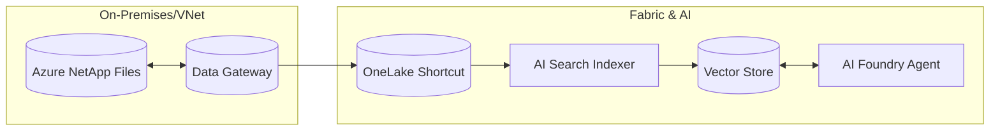

# Workshop Walkthrough

I have prepared a complete content package for your **Azure NetApp Files to Azure AI Foundry Workshop**. This package enables you to demonstrate a sophisticated "Zero-Copy" RAG architecture to financial customers.

## Architecture Overview

The following diagram illustrates the data flow users will build:

## Included Artifacts

### 1. The Lab Guide (`lab_guide.md`)
*   **Path**: [lab_guide.md](file:///Users/dwirefs/.gemini/antigravity/brain/a59cccc5-2ee2-43ef-94f7-912d14d9b49f/lab_guide.md)
*   **Status**: **Enhanced**.
*   **Key Improvements**:
    *   Added a detailed **Architecture Diagram**.
    *   Expanded **Prerequisites** with required RBAC roles.
    *   **Step-by-Step Instructions**: Now includes granular clicks (e.g., "Select Amazon S3 Compatible", "Copy Endpoint URL").
    *   **Practical Testing Section**: Added 4 specific agent scenarios (Unstructured retrieval, Structured analysis, Cross-source synthesis, Compliance check) with expected outcomes.

### 2. Dummy Data Suite (`test_data/`)
*   **Path**: [test_data](file:///Users/dwirefs/.gemini/antigravity/brain/a59cccc5-2ee2-43ef-94f7-912d14d9b49f/test_data)
*   **Status**: **Ready**.
*   **Contents**:
    *   `invoices/`: 10 HTML invoices representing unstructured vendor bills.
    *   `financial_statements/`: 2 CSV files representing structured ERP transaction logs.

## How to use this
1.  **Distribute**: Send the `lab_guide.md` and `test_data` folder to your workshop participants.
2.  **Pre-Flight**: ensure their subscriptions are whitelisted for the ANF Object Access preview interactively.
3.  **Run**: Follow the guide Module-by-Module. The new "Practical Testing" section in Module 5 provides a strong "wow" moment for the demo.
