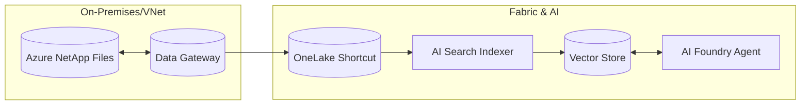

# Workshop Walkthrough: Zero‑Copy RAG with Azure NetApp Files, OneLake, and Azure AI Foundry

**How to use this walkthrough**
This walkthrough is meant to be followed alongside the lab guide, step‑by‑step, in the same order.
The lab guide tells you what to do.
This walkthrough explains why each step exists and what to emphasize as you go.

## Architecture Overview

The following diagram illustrates the data flow users will build:

## Included Artifacts

### 1. The Lab Guide (`lab_guide.md`)
*   **Path**: [lab_guide.md](file:///Users/dwirefs/.gemini/antigravity/brain/a59cccc5-2ee2-43ef-94f7-912d14d9b49f/lab_guide.md)
*   **Status**: **End-to-End Comprehensive**.
*   **Lab Overview**:
#### 1.   Validate Azure Subscription Requirements
**What we’re doing**

We’re making sure the Azure subscription is fully enabled to support storage, analytics, and AI services before we start building anything.

**Why this matters**

This workshop spans multiple Azure services—Azure NetApp Files, Microsoft Fabric, Azure AI Search, and Azure AI Foundry.
If required resource providers or permissions are missing, later steps can fail in ways that are hard to diagnose.
What to emphasize to customers
*   This is standard Azure hygiene, not something unique to this solution.
*   We’re front‑loading this to avoid surprises later.
*   Once this is done, the rest of the workshop focuses on solution flow, not subscription troubleshooting.
#### 2.   Prepare Azure NetApp Files (Storage)
##### 2.1–2.2 Create NetApp Account, Pool, and Volume
**What we’re doing**

We’re creating an Azure NetApp Files volume that will act as the authoritative system of record for enterprise file data.

**Why this matters**

Azure NetApp Files provides:
*   Enterprise file semantics (NFS/SMB)
*   High performance and low latency
*   Governance and durability
This data is not being migrated or transformed—it remains in place throughout the workshop.

**Key point**

Once this volume exists, Azure NetApp Files is fully configured.
Everything that follows is about how other services consume this data without copying it.

##### 2.3 Enable Object (S3‑Compatible) Access
**What we’re doing**

We’re enabling the Azure NetApp Files Object REST API so the same file data can be accessed through an S3‑compatible interface.

**Why this matters**

Many analytics and AI platforms—including Microsoft Fabric—expect object‑based access.
This step allows:
*   File‑based applications to continue using NFS
*   Analytics and AI platforms to access the same data via S3

**What to emphasize**
*   This is still the same data.
*   No ingestion, duplication, or ETL is happening.
*   We’re exposing another access path, not creating another copy.

##### 2.4 Upload Lab Data
**What we’re doing**

We’re placing sample unstructured data into Azure NetApp Files so we have real content to work with.

**Why this matters**

This data will later be:
*   Virtualized into OneLake
*   Indexed by Azure AI Search
*   Used to ground an AI agent

At no point will it be copied into a separate data store.

#### 3. Create a OneLake Shortcut to Azure NetApp Files
##### 3.1 Deploy Data Gateway (Required for Private Endpoints)
**What we’re doing**

We’re deploying a Microsoft Fabric Standard Data Gateway.

**Why this matters**

This gateway is required by Microsoft Fabric, not by Azure NetApp Files.
Fabric needs a secure way to reach:
*   Private
*   VNet‑isolated
*   S3‑compatible endpoints

Azure NetApp Files Object REST API falls into that category.

**Important clarification**

Azure NetApp Files does not require a gateway.
The gateway exists purely to allow Fabric to access private storage securely.

##### 3.2 Create Fabric Workspace
**What we’re doing**

We’re creating a Microsoft Fabric workspace that will own:
*   The Lakehouse
*   The OneLake shortcut
*   Permissions used later by Azure AI Search

**Why this matters**

In Fabric:
*   Workspaces define ownership and governance
*   AI Search and Foundry permissions flow from the workspace

This keeps access control consistent and centralized.

##### 3.3 Create Connection and OneLake Shortcut
**What we’re doing**

We’re creating a OneLake shortcut that points to the Azure NetApp Files bucket using S3‑compatible access.

**Why this matters**

This is the core architectural moment of the workshop:
*   OneLake now has a logical view of data that physically lives in Azure NetApp Files
*   No data is copied into Fabric
*   Any Fabric‑connected service can now “see” the data

**What to emphasize**
*   Shortcuts are virtualization, not ingestion
*   This is how we avoid data sprawl
*   The data remains governed by its original storage system

#### 4. Index OneLake Data Using Azure AI Search
##### 4.1 Create Azure AI Search Service
**What we’re doing**

We’re creating Azure AI Search to act as the retrieval layer for RAG.

**Why this matters**

Azure AI Search:
*   Indexes unstructured content
*   Creates embeddings
*   Enables fast, relevant retrieval for AI applications

This is what bridges data and AI.

##### 4.2 Assign Permissions
**What we’re doing**

We’re granting the Azure AI Search managed identity access to the Fabric workspace.

**Why this matters**

Azure AI Search must be able to:
*   Read OneLake data
*   Respect Fabric security boundaries

Without this permission, indexing will silently fail.

##### 4.3 Import and Vectorize Data
**What we’re doing**

We’re indexing the OneLake shortcut and generating embeddings.

**Why this matters**

This step turns raw files into:
*   Searchable content
*   Vector representations usable by AI agents

**Workshop guardrails to mention verbally**
*   We index files under the Lakehouse Files/ path
*   We avoid sensitivity‑labeled content for this workshop
*   We use reasonably sized text‑based documents

These keep the workshop focused on solution flow.

#### 5. Connect OneLake to Azure AI Foundry
##### 5.1 Create Azure AI Services Resource and Deploy Models
**What we’re doing**

We’re provisioning the AI runtime and deploying the models used by the agent.

**Why this matters**

This ensures:
*   Predictable behavior during the workshop
*   Explicit control over models and region
*   No hidden dependencies

**What to emphasize**

In production, model choices may vary.

For the workshop, we standardize this to keep things smooth.

##### 5.2 Assign User Permissions
**What we’re doing**

We’re granting the user permission to interact with deployed models.

**Why this matters**

Without this, the Foundry UI may load but inference will fail.

This step makes sure:
*   The workshop can proceed without RBAC friction
*   Attendees can focus on the experience, not access errors

##### 5.3 Create Foundry Hub and Project
**What we’re doing**

We’re creating a Foundry project and wiring it to:
*   Azure AI Search
*   The deployed models

**Why this matters**

The project is where:
*   Agents are defined
*   Knowledge sources are attached
*   Evaluation and iteration happen

##### 6. Run and Validate a Grounded Agent
**What we’re doing**

We’re creating an AI agent and grounding it on the indexed enterprise data.

**Why this matters**

This is the payoff:
*   The agent answers questions
*   Responses are grounded in real enterprise files
*   Data stays in Azure NetApp Files the entire time

**What to emphasize**

This is not a demo on sample data in a hidden store.

This is AI operating directly on governed enterprise data—without copying it.

#### Closing Message for the Workshop
What we’ve shown is a repeatable pattern:

*   Azure NetApp Files as the system of record
*   OneLake as a virtualization layer
*   Azure AI Search as retrieval
*   Azure AI Foundry as the AI execution layer

This pattern scales from workshops to real enterprise deployments, while minimizing risk, duplication, and operational overhead.

### 2. Dummy Data Suite (`test_data/`)
*   **Path**: [test_data](file:///Users/dwirefs/.gemini/antigravity/brain/a59cccc5-2ee2-43ef-94f7-912d14d9b49f/test_data)
*   **Status**: **Ready**.
*   **Contents**:
    *   `invoices/`: 10 HTML invoices representing unstructured vendor bills.
    *   `financial_statements/`: 2 CSV files representing structured ERP transaction logs.

## How to use this
1.  **Distribute**: Send the `lab_guide.md` and `test_data` folder to your workshop participants.
2.  **Pre-Flight**: ensure their subscriptions are whitelisted for the ANF Object Access preview interactively.
3.  **Run**: Follow the guide Module-by-Module. The new "Practical Testing" section in Module 5 provides a strong "wow" moment for the demo.
